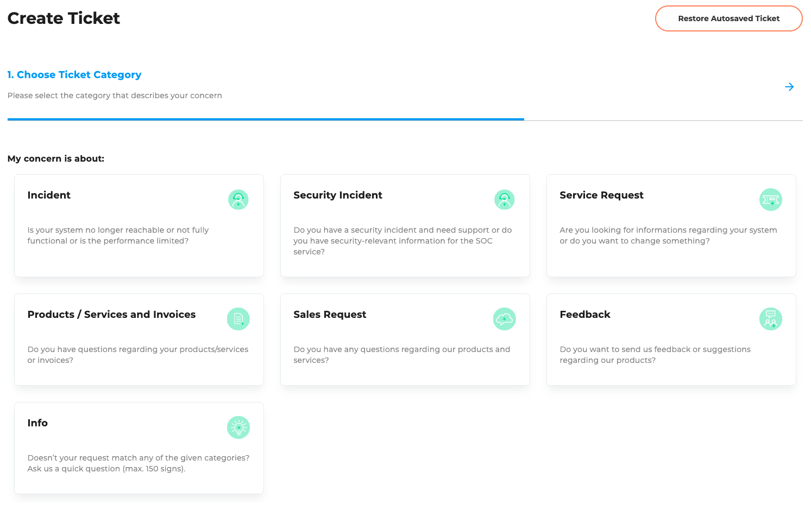
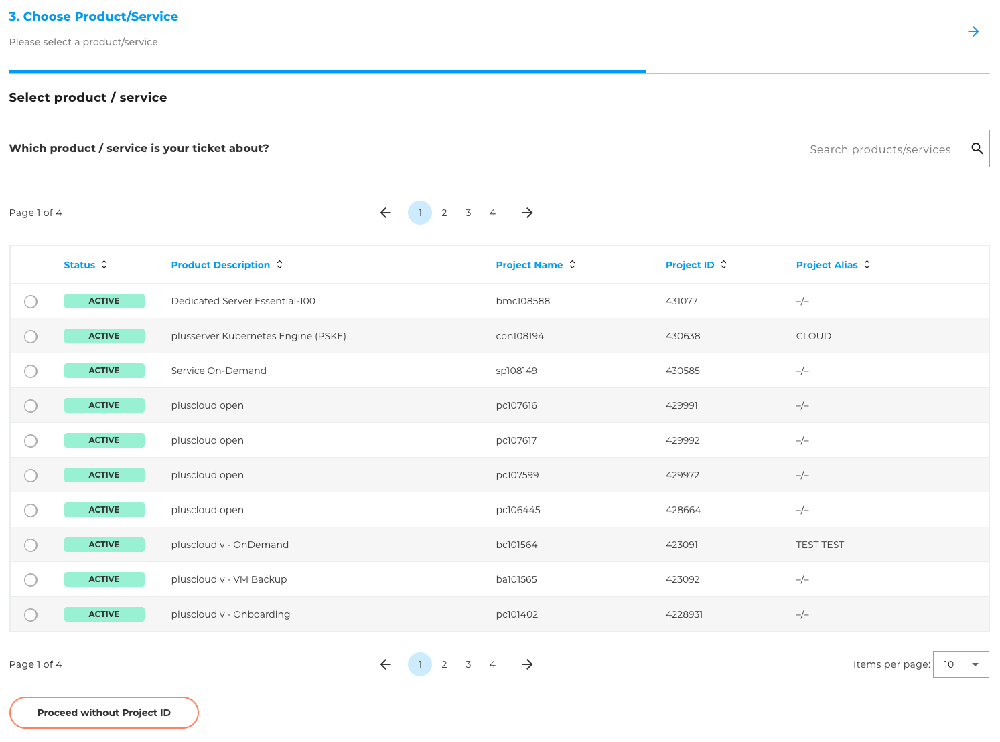
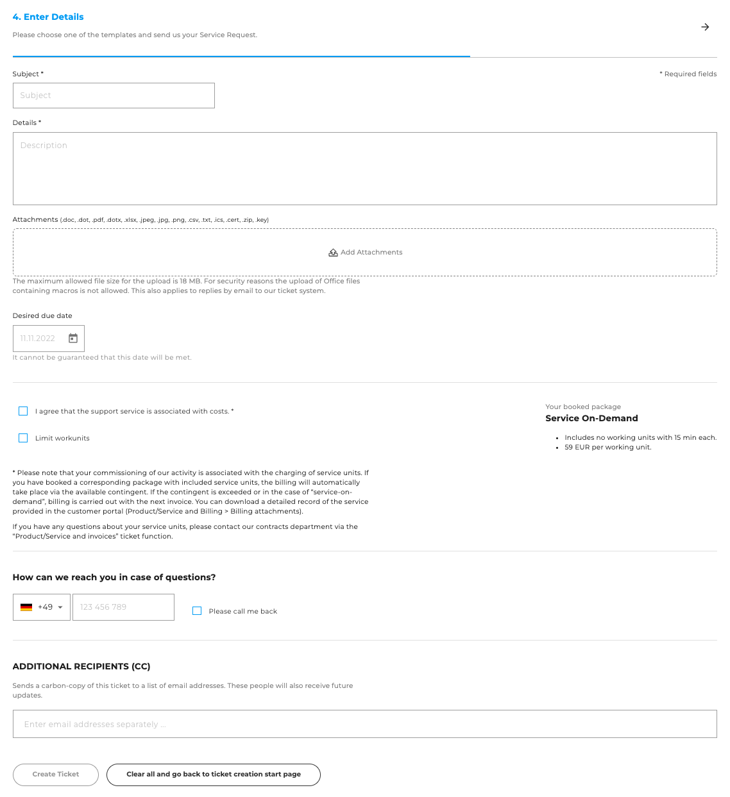

## Create Ticket

On the ["Create ticket"](https://cloudhub.plusserver.com/support/ticket-create) page, you can create a new support ticket. The form guides you step by step through the creation process and adapts depending on the selected category and, if applicable, template.

### Steps for creating a ticket

1. **Select category:**
   First, select the appropriate category for your request (e.g. technical support, billing, contract questions).
   This selection determines what information will be requested later on.
   

2. **Select template (optional):**
   If templates are available for the selected category, you have the option of selecting a suitable template.
   

3. **Select product or service (optional):**
   You can assign the ticket to a specific product or service.
   

4. **Enter details:**
   Specific information will be requested depending on the selected category and template.
   Please enter all relevant details about your request here so that our support team can process your ticket efficiently.
   

### Restore ticket

If you have already partially completed the ticket creation form and left the page, you can restore your entries.
To do this, use the **"Restore ticket"** button located at the top right of the page.

