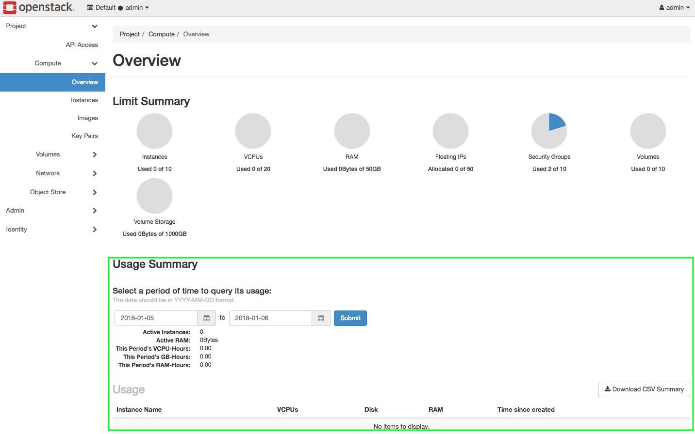

---
#https://gohugo.io/content-management/page-bundles/
title: "Inaccurate display of consumption data in Horizon"
type: "docs"
date: 2023-08-13
description: >
  The display of consumption data in the Horizon Dashboard does not match the billing data.
---

If you compare the consumption data in the Horizon Dashboard with the data on your invoice, you will notice discrepancies. The reason for this is that the display in Horizon is not very precise, and we do not use it as the source for billing. Please consider these values more as an estimate of your usage. A detailed overview of ongoing costs will soon be integrated into our Cloud Hub.
