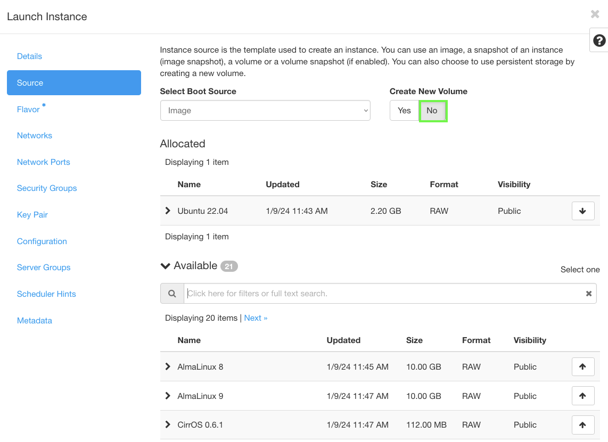
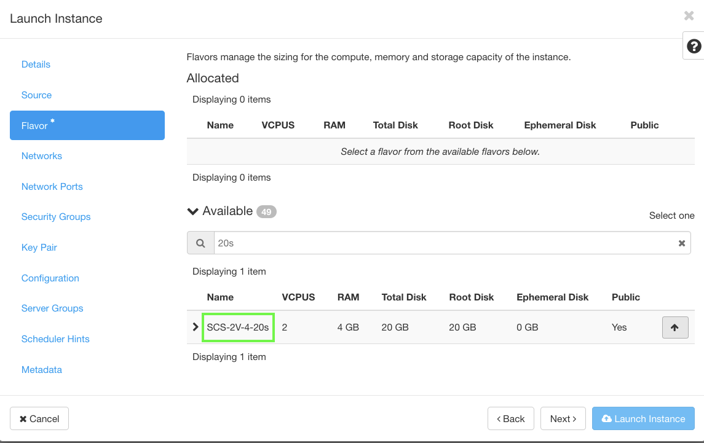

## Overview

{}
pluscloud open will soon offer the Local SSD Storage option.
{}

Standard shared storage based on Ceph has a balanced performance profile that is not suitable for all use cases. In particular, Etcd and transactional databases such as Postgres are known to have performance issues here.

pluscloud open offers Local SSD Storage as an option for storing data on instances. Local SSD Storage is non-shared storage that is physically attached to the instance and provides high input/output operations per second (IOPS) and low latency. It is ideal for applications that require high performance and low latency.

Local SSD Storage is ideal for volatile or temporary workloads such as caches. Also good candidates for Local SSD Storage are highly automated replicated databases or key-value stores such as Patroni or Etcd, which have automatic replication and failover built into the software stack.

{}
Local SSD Storage shares the same lifecylce as the VM instance. If the VM is deleted or crashes the Local SSD Storage data will be lost as well. What's more, your VMs cannot be resized or live-migrated to another hypervisor in case of a hypervisor maintenance. In the event of a hardware failure your Local SSD data could be completely lost. Even if there is no disk failure, there will be regular disk downtime.
{}

### Comparison of the characteristics of Ceph volumes with those of Local SSD Storage

There are fundamental differences between Ceph volumes with those of Local SSD Storage.

As with shared storage, the underlying storage system provides redundancy and availability. Your application can rely on the 3x replicated highly available storage.

As with Local SSD Storage, you can access the local disk in a raw fashion and achieve near 1:1 performance. However, your software stack is responsible for handling redundancy and availability.

**Use cases for Local SSD Storage:**

* Kubernetes
* Etcd Cluster with 3 or 5 instances
* Postgres Patroni Cluster

**Anti-patterns for Local SSD Storage:**

* Traditional single server setup
* VMs treated like pets
* VMs without snapshots

The following table compares the characteristics of Ceph volumes with those of Local SSD Storage:

| Characteristics  | Ceph boot volume  | Local SSD Storage boot volume  |
|------------------|-------------------|--------------------------------|
| Storage Provider  | Cinder           | Nova                           |
| Throughput  |  <span style="color: red;">LOW</span>  | <span style="color: green;">HIGH</span>  |
| Latency  | <span style="color: red;">HIGH</span>  | <span style="color: green;">LOW</span>  |
| Live-migration  | <span style="color: green;">YES</span>  | <span style="color: red;">NO</span>  |
| Availability  | <span style="color: green;">HIGH</span>  | <span style="color: red;">LOW</span>  |
| Ephemeral  | NO  | YES  |

### Availability

There are two cases where VMs running on Local SSD Storage will experience downtime

#### Periodic reboots

Any Local SSD Storage hypervisor will need to be **rebooted periodically**.  Typically this will be **once a month**. You should therefore expect your VMs to be down on a regular basis.

The average downtime is **approximately half an hour**, but can vary. All VMs will receive an ACPI shutdown signal prior to maintenance. VMs are given **one minute to shut down** properly.

After this time, they will simply shut down.

You should expect your VMs to **remain powered off** after the hypervisor reboots. We are currently planning a feature that will allow you to configure the VM to automatically restart if necessary.

There will be a **30 minute pause** between hypervisor reboots. This will give your software stack time to reconfigure.

However, all VMs on the same hypervisor will be affected. You will need to enable **anti-affinity** [Server Groups](../instances-and-images/server-groups/).

#### Hardware Failure

In the event of a complete hardware failure or reconfiguration, you must **expect data loss**.

In these cases, the boot disks will be lost. This means that when the hypervisor comes back up, there will be corrupted VMs.

You will be expected to **wipe these VMs yourself**. This is because we believe it is better to keep broken VM definitions so that you can more reliably restore these instances from a backup or snapshot. You will have to pay for broken VMs.

Speaking of backups: You should take regular snapshots to be able to restore a failed VM in the event of a hardware failure of the underlying hypervisor.

#### Use Server Groups and Anti-Affinity to Achieve Fault Tolerance

If you are using Local SSD Storage, **you are strongly encouraged to create fault tolerance** against hypervisor failures.

One thing you can do is to use [Server Groups](../instances-and-images/server-groups/) to distribute your VMs across multiple hypervisors.

## Using Local SSD Storage

To use Local SSD Storage, simply create a VM with a specific Local SSD Storage Flavor. All Flavors that end with an "**s**" indicate Local SSD Storage. Configure the VM to boot without a volume. This is crucial if you want the VM to boot from a local disk instead of a remote volume.

After you have created the VM, it will boot with a local disk from the **/dev/sda1** block device. You can attach additional volumes to your VM. However, these volumes will come from the Ceph shared storage.

Examples for Local SSD Storage Flavors:

| Name           | VCPUs | RAM (MB)   | Disk (GB) |
|----------------|-------|-------|------|
| SCS-2V-4-20s   | 2     |  4096 |  20  |
| SCS-4V-16-100s | 4     | 16384 | 100 |

{}
Do not create a boot volume! If you were to create a boot volume, your VM would boot from a Cinder volume on shared storage.
{}

### Creating a VM with Horizon

To create a VM to use Local SSD Storage, follow these steps:

Navigate to the Launch Instance dialogue box. In "**Details**", set "**Instance Name**".

<center>

<br/><br/>
</center>

In "**Source**", select your favourite cloud image. Leave the default to boot from image and not create a volume.

<center>

<br/><br/>
</center>

In "**Flavor**", select one of the Flavors ending in "**s**".
<center>

<br/><br/>
</center>

Configure the rest as you like. Finally, start the instance.


### Creating a VM with the CLI

To create an identical VM using the Openstack CLI, use the following command:

```bash
openstack server create --flavor SCS-2V-4-20s --image "Ubuntu 22.04" demo-cli
```

The output should look like this:

```

+-----------------------------+-----------------------------------------------------+
| Field                       | Value                                               |
+-----------------------------+-----------------------------------------------------+
| OS-DCF:diskConfig           | MANUAL                                              |
| OS-EXT-AZ:availability_zone |                                                     |
| OS-EXT-STS:power_state      | NOSTATE                                             |
| OS-EXT-STS:task_state       | scheduling                                          |
| OS-EXT-STS:vm_state         | building                                            |
| OS-SRV-USG:launched_at      | None                                                |
| OS-SRV-USG:terminated_at    | None                                                |
| accessIPv4                  |                                                     |
| accessIPv6                  |                                                     |
| addresses                   |                                                     |
| adminPass                   |                                                     |
| config_drive                |                                                     |
| created                     | 2024-02-09T13:21:50Z                                |
| flavor                      | SCS-2V-4-20s                                        |
| hostId                      |                                                     |
| id                          | abcdef08-bf2a-4375-bfe3-0f48755df3db                |
| image                       | Ubuntu 22.04                                        |
| key_name                    | None                                                |
| name                        | demo-cli                                            |
| progress                    | 0                                                   |
| project_id                  | abcdef05fd7d49c2bdbf9bc66f5b6ed4                    |
| properties                  |                                                     |
| security_groups             | name='default'                                      |
| status                      | BUILD                                               |
| updated                     | 2024-02-09T13:21:50Z                                |
| user_id                     | abcdef07436c4f15a4eb77ed737c3206                    |
| volumes_attached            |                                                     |
+-----------------------------+-----------------------------------------------------+
```

{}
"**volumes_attached**" should be empty unless you're adding additional shared storage volumes.
{}

w