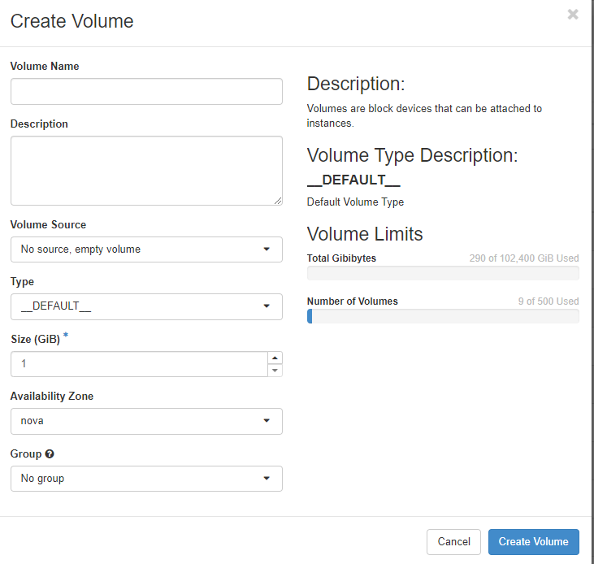

## Volumes

Volumes represent (Block) Storage in OpenStack. Volumes are used as disks in instances. If not explicitly mentioned otherwise, volumes reside on a [Ceph](https://ceph.io/en/) storage system and are attached to the instance via network using the [RADOS](https://docs.ceph.com/en/quincy/rbd/index.html) protocol.
The "**Volumes**" menu allows you to manage volumes in your project. 

You can create new volumes, backups and snapshots as well as group your volumes (e. g. to take snapshots of them all at once). The list shows the volumes by their unique ID, but you can change the names of your volumes if you wish. You can also see whether the volume is currently attached to an instance (and where), the size of the volume and whether it is a member of a volume group. The "**Actions**" button gives you access to the various management options available for your volumes.

With "**Edit Volume**" you can change the name of your volume and/or add a description for it. This can be helpful to make the purpose of the volume clear. Furthermore you can set the boot flag for a volume here. "**Manage Attachments**" allows you to attach or detach a volume to or from an instance. Be aware that after attaching a volume, you will most likely have to change some configuration bits on your instance, such as putting a filesystem on the new volume, editing /etc/fstab and mount it, etc. Before detaching a volume from your instance, you should unmount it.

"**Create Snapshot**" allows you to take a snapshot of the current volume. You must first give it a name (and an optional description). Please note, that taking a snapshot of a volume that is mounted and in use may result in data corruption. The safest way to take a snapshot is to unmount the volume first. Snapshots are not backups.

Use "**Create Backup**" to create a backup of your volume. If you select a snapshot of your volume, only the snapshot will be backed up. If your volume backup fits into your Object Store quota, you can select an Object Store bucket and write the backup to it.

You can convert a volume to an image which you can use to create an instance with "**Upload to Image**". You must select a disk format for the image (usually "raw"). If the volume is in use you can "force" the backup by clicking "**Force**".

With "**Update Metadata**" you can manage the volume metadata. You will find predefined metadata definitions that you can use or you can define custom metadata with the "**Custom**" field. The maximum length for a single key is 255 characters.

### Accept transfer

When you are transferring volumes from one project to another, you can accept a transfer by clicking on "Accept Transfer". Transfers are initiated from the command line using ``openstack volume transfer request``. The owner of a volume creates a transfer request and sends the transfer ID and a key to the recipien of the volume. The recipient clicks "Accept Transfer" and enters the transfer ID and key to receive the volume.

### Create volume

To create a new volume you click on "+Create Volume" and then you will be taken through a few menus to define the new volume:

In addition to a name and an optional description, you can choose a "**Volume Source**", e. g. an image, a snapshot or other volumes. Depending on your choice, the input fields change (but they are self-explanatory). The chosen source determines the size of the new volume. You can assign the volume to previously defined volume "**Group**".

## Backups

The "**Backups**" menu lists your current backups and allows you to either delete them or use them for recovery (e. g. by creating a new volume from the backup).

## Snapshots

Here you see a list of your current snapshots and you can manage them. This includes launching an instance from a snapshot with "**Launch as Instance**", changing the name or description of a snapshot, creating a backup of your snapshot with "**Create Backup**", delete the snapshot or change the metadata for your snapshot.  You can choose from a set of predefined metadata or add "**Custom**" metadata keys. The maximum key length is 255 characters.

## Groups

Volume groups allow you to create a group of volumes that you want to treat as one. It can be useful to snapshot volumes, that contain different parts of an application in one snapshot to assure data consistency. You can use "**Create Group**" to create new groups or edit existing ones.

## Group snapshots

Here you can manage your group snapshots.

## Encrypted volumes

Pluscloud open allows you to create encrypted volumes, which are based on "LUKS" ([Linux Unified Key Setup](https://gitlab.com/cryptsetup/cryptsetup)), which uses the Linux kernel module dm-crypt and is ideal for encrypting volumes for Linux instances. Keys are generated during the creation of the volume and saved into the keystore on pluscloud open. Be aware that deleting encrypted volumes not only deletes the volume but also the associated key. **Recovery of the data will not be possible** after deletion. 

Creating an encrypted volume is pretty easy. You just choose "LUKS" as "**Type**":

Depending on the size of the volume, it may take some time to create. You can use the volume just like any other unencrypted volume. The encryption is done in the background. The volume listing should show your volume as encrypted:

The web GUI does not allow the creation of encrypted root volumes, which you need if you want all the volumes of your instance to be crypted.

### Encrypted boot images

To encrypt the root volume of an instance, you must first create an encrypted volume first to use that as a root volume for a new instance. You create this volume from an image of the operating system you want to use for your new instance:
    
    openstack volume create --type LUKS --image "imagename" --size <size in gb> <volume name>
     
    openstack volume create --type LUKS --image "Ubuntu 20.04" --size 20 ubuntuencrypt
    +---------------------+--------------------------------------+
    | Field               | Value                                |
    +---------------------+--------------------------------------+
    | attachments         | []                                   |
    | availability_zone   | nova                                 |
    | bootable            | false                                |
    | consistencygroup_id | None                                 |
    | created_at          | 2021-12-10T09:06:49.000000           |
    | description         | None                                 |
    | encrypted           | True                                 |
    | id                  | cd4d8c9a-632a-4045-8b09-da57fcbc5848 |
    | multiattach         | False                                |
    | name                | ubuntuencrypt                        |
    | properties          |                                      |
    | replication_status  | None                                 |
    | size                | 20                                   |
    | snapshot_id         | None                                 |
    | source_volid        | None                                 |
    | status              | creating                             |
    | type                | LUKS                                 |
    | updated_at          | None                                 |
    | user_id             | 824e462845c14ccd84cb091944dfe74b     |
    +---------------------+--------------------------------------+

The parameter "**--image**" allows you to create a volume directly from an image (either from the repository or uploaded by yourself).

Now you can create an instance using the volume you just created. You need to add a flavor (name or ID) and you should not forget to add an SSH key name that will allow you to log in to the instance. You also need to add an existing network, where the instance will be spawned:

    openstack server create --flavor <Flavor name or ID> --network <network name or ID> --key-name <keyname> --volume <volumename or ID> <instancename>
 
    openstack server create --flavor 1C-1GB-20GB --network Test --key-name mhamm --volume cd4d8c9a-632a-4045-8b09-da57fcbc5848 bootencubuntu
    +-----------------------------+----------------------------------------------------+
    | Field                       | Value                                              |
    +-----------------------------+----------------------------------------------------+
    | OS-DCF:diskConfig           | MANUAL                                             |
    | OS-EXT-AZ:availability_zone |                                                    |
    | OS-EXT-STS:power_state      | NOSTATE                                            |
    | OS-EXT-STS:task_state       | scheduling                                         |
    | OS-EXT-STS:vm_state         | building                                           |
    | OS-SRV-USG:launched_at      | None                                               |
    | OS-SRV-USG:terminated_at    | None                                               |
    | accessIPv4                  |                                                    |
    | accessIPv6                  |                                                    |
    | addresses                   |                                                    |
    | adminPass                   | jy8CoGki7HL8                                       |
    | config_drive                |                                                    |
    | created                     | 2021-12-10T09:16:50Z                               |
    | flavor                      | 1C-1GB-20GB (cb635210-085e-4659-a10e-d1dcddf897f9) |
    | hostId                      |                                                    |
    | id                          | ca0bba1f-64e7-4678-bf49-bfe9ad71881d               |
    | image                       | N/A (booted from volume)                           |
    | key_name                    | mhamm                                              |
    | name                        | bootencubuntu                                      |
    | progress                    | 0                                                  |
    | project_id                  | 5b6bd2a13a624b5b8b393971cc03324a                   |
    | properties                  |                                                    |
    | security_groups             | name='default'                                     |
    | status                      | BUILD                                              |
    | updated                     | 2021-12-10T09:16:50Z                               |
    | user_id                     | 824e462845c14ccd84cb091944dfe74b                   |
    | volumes_attached            |                                                    |
    +-----------------------------+----------------------------------------------------+

The instance is now using encrypted storage. Please remember to delete the volume after deleting the instance as it will not be deleted automatically.

### List secrets

As mentioned earlier, there is a key stored to the OpenStack keystore (Barbican) for each encrypted volume. You can list all the keys stored for your project using the command ``openstack secret list``.
