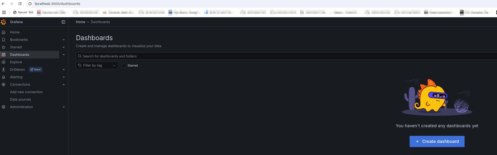
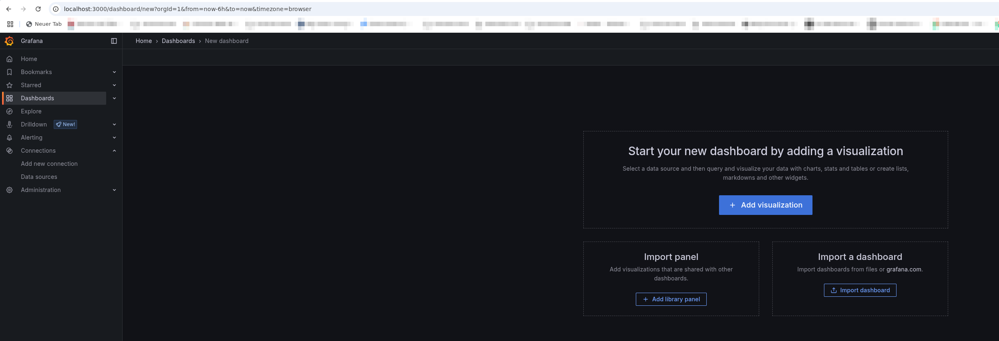
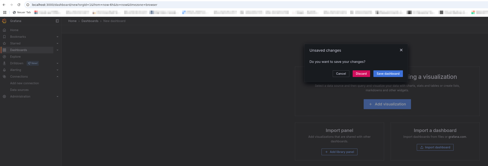
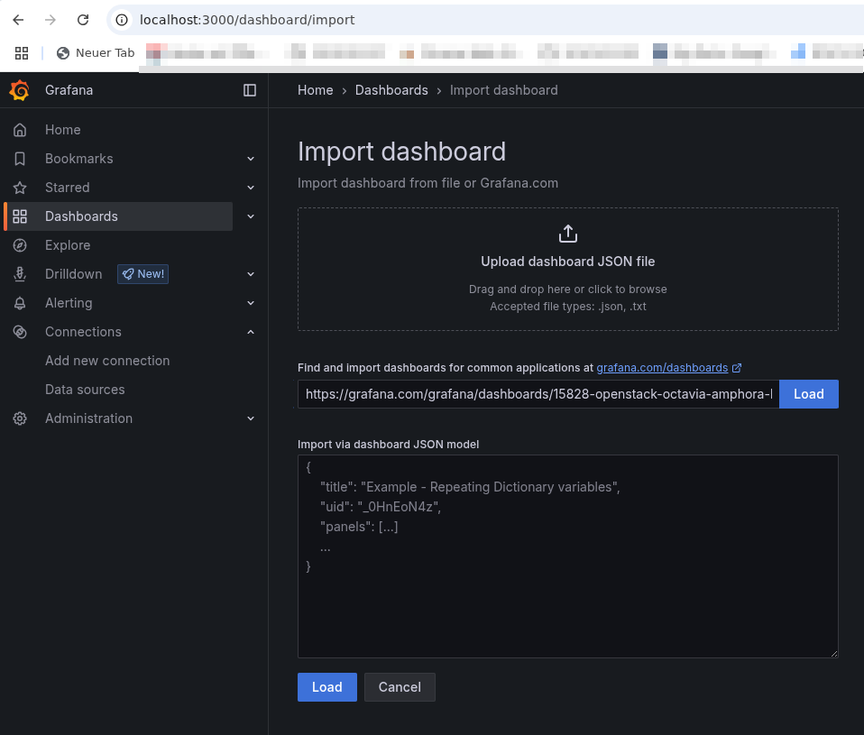
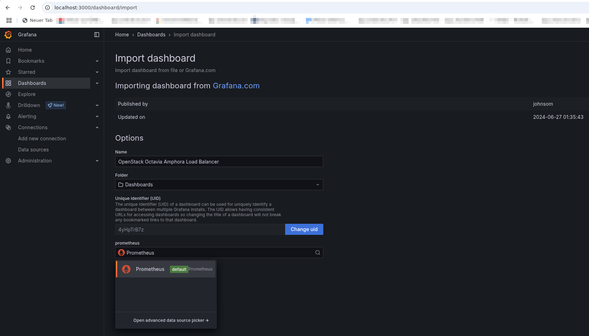
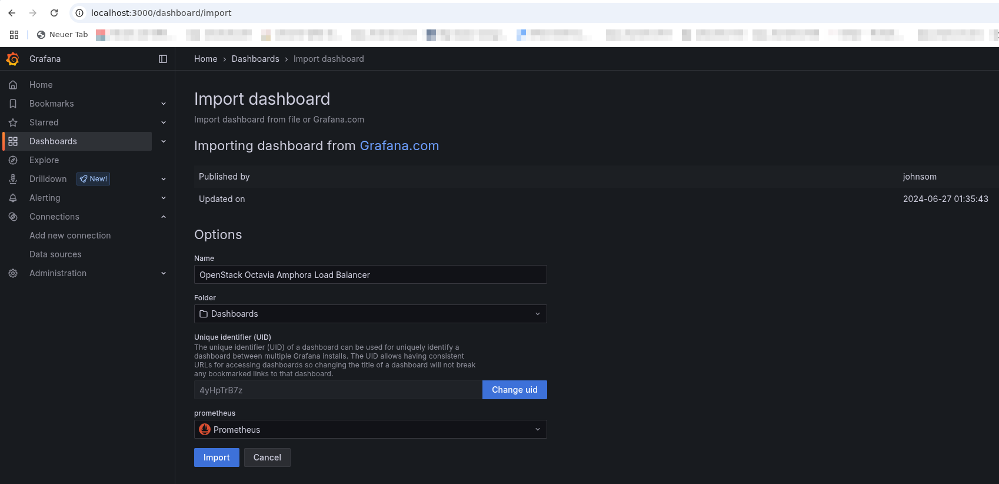
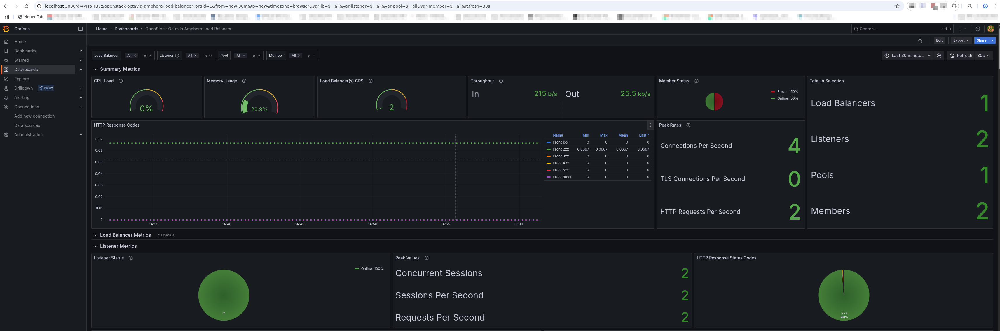

---
#https://gohugo.io/content-management/page-bundles/
title: "Fetch and visualize loadbalancer metrics with Prometheus and Grafana"
type: "docs"
weight: 1
date: 2025-05-13
description: >
  Collect performance data from your loadbalancer in your own prometheus instance and visualize it in grafana
---

## Overview

If you use one or more loadbalancers (Octavia) in your projects, it makes sense to collect their performance data with Prometheus and then visualize it with Grafana, for example.

This tutorial presents one way of doing this.

## Requirements

This tutorial assumes that you already have an OpenStack project in the pluscloud open, that at least one instance (e.g. with Ubuntu) is running in this project and that Docker is already installed on it. Furthermore, the instance should already be accessible by you via a floating IP and via SSH. It is also helpful if you have installed the OpenStack client to manage your environment.

## Create the loadbalancer

First we create the loadbalancer and the listener for Prometheus:

    openstack loadbalancer create --name testlb --vip-subnet-id <Your-Subnet-Name> --wait
    openstack loadbalancer listener create --name stats-listener --protocol PROMETHEUS --protocol-port 8088 testlb

For "Your-Subnet-Name", you must enter your desired subnet. You can easily list these with the OpenStack client:

    openstack subnet list

After the loadbalancer has been created, you should find out the `vip_address` with

    openstack loadbalancer list

and save it for later. That could look like this, for example:

    openstack loadbalancer show -c vip_address testlb

After a loadbalancer has been created with the corresponding listener, the tools are now created to collect and visualize the metrics.

## Deploy prometheus and grafana via docker-compose

To do this, save the following configuration file under the name `docker-compose.yml` on your OpenStack instance in a separate directory (e.g. `/data/prometheus-grafana/`) (the three dashes belong to it!).

    ---
     
    volumes:
      prometheus_data:
      grafana_data:
    
    services:
      prometheus:
        image: prom/prometheus
        container_name: prometheus
        restart: unless-stopped
        volumes:
          - ./prometheus/:/etc/prometheus/
          - prometheus_data:/prometheus
        ports:
          - 9090:9090
        command:
          - '--config.file=/etc/prometheus/prometheus.yaml'
          - '--storage.tsdb.path=/prometheus'
      grafana:
        image: grafana/grafana
        container_name: grafana
        restart: unless-stopped
        volumes:
          - grafana_data:/var/lib/grafana
        ports:
          - 3000:3000
        environment:
          - GF_SECURITY_ADMIN_USER=admin
          - GF_SECURITY_ADMIN_PASSWORD=S3cure!

Please set your own password for Grafana!

Then create the directory `/etc/prometheus` on the instance

    mkdir -p /etc/prometheus

and save the following configuration file there under the name `prometheus.yaml`.

    global:
      scrape_interval: 15s
      evaluation_interval: 15s
      scrape_timeout: 10s 

    scrape_configs:
    - job_name: 'Octavia LoadBAlancer'
      static_configs:
      - targets: ['LB_IP:8088']

Instead of “LB_IP”, please enter the IP address that you previously saved above.

You can then start Prometheus and Grafana with the following command

    /data/prometheus-grafana: docker compose up -d

## Set up Prometheus as a datasource for Grafana

In order to visualize the metrics generated by the loadbalancer, Prometheus must first be set up as the data source in Grafana. To do this, you can use the following script by saving it e.g. under `/data/prometheus-grafana/setup_grafana_datasource.sh`, making it executable with `chmod +x /data/prometheus-grafana/setup_grafana_datasource.sh` and then executing it. Be sure to change the password to the one selected above beforehand!

    #!/usr/bin/env bash
    
    GRAFANA_URL="http://localhost:3000"
    DASHBOARD_ID="15828"
    DATASOURCE_NAME="Prometheus"
    DATASOURCE_TYPE="prometheus"
    DATASOURCE_URL="http://prometheus:9090"
    ADMIN_USER="admin"
    ADMIN_PASSWORD="S3cure!"

    # install if not there: curl
    which curl &> /dev/null || sudo apt update && sudo apt install -y curl

    # Wait until Grafana is up
    until $(curl --output /dev/null --silent --head --fail $GRAFANA_URL); do
        echo "Waiting for Grafana..."
        sleep 5
    done

    echo "Grafana is up and running. Adding Datasource..."

    # Test whether Datasource is already set up
    if ! curl -s -u "$ADMIN_USER:$ADMIN_PASSWORD" "$GRAFANA_URL/api/datasources" | grep -q "\"name\":\"$DATASOURCE_NAME\""; then
        # Add the Prometheus Datasource
        curl -s -X POST "$GRAFANA_URL/api/datasources" \
            -H "Content-Type: application/json" \
            -u "$ADMIN_USER:$ADMIN_PASSWORD" \
            -d "{
                \"name\": \"$DATASOURCE_NAME\",
                \"type\": \"$DATASOURCE_TYPE\",
                \"access\": \"proxy\",
                \"url\": \"$DATASOURCE_URL\",
                \"isDefault\": true,
	        \"uid\": \"$DASHBOARD_NAME\",
                \"jsonData\": {
                    \"timeInterval\": \"5s\"
                }
            }"
        echo "Datasource '$DATASOURCE_NAME' added."
    else
        echo "Datasource '$DATASOURCE_NAME' was already configured."
    fi
    echo "Datasource added."

## Import Octavia Dashboard into Grafana

To access the Grafana web interface, you must first set up port forwarding via ssh. This works with the following command, using the floating IP address for “Floating IP” that you have assigned to the instance on which you have just started Prometheus and Grafana via Docker.

    ssh <Floating-IP> -l ubuntu -L 3000:localhost:3000 -L 9090:localhost:9090

You should then be able to browse the Grafana web interface in your local web browser under the URL http://localhost:3000/ and log in with the user “admin” and the password you previously entered.

Once this is done, you should import the appropriate dashboard to visualize the data collected by Prometheus. To do this, click on the "Dashboards" menu item in the menu on the left. You should see approximately the following website:

After clicking on “Create Dashboard”, a selection menu appears, which also contains the option “Import Dashboard”. Please select this option by clicking on it:

Please close the pop-up requester with "Discard":

The URL for the dashboard to be imported must first be entered in the import menu. In our case, this is

    https://grafana.com/grafana/dashboards/15828-openstack-octavia-amphora-load-balancer/

Please load it with a click on "Load".

From the import menu please choose the datasource "Prometheus":

After this please import the dashboard with clik on "Import":

Now the freshly imported dashboard should at least open:

