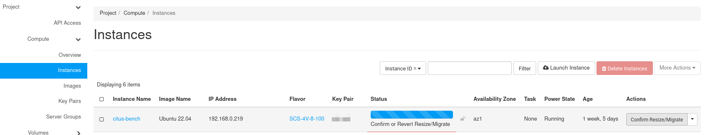

---
#https://gohugo.io/content-management/page-bundles/
title: "Instance Resize"
type: "docs"
weight: 1
date: 2024-07-30
description: >
  Resize your instances
---

## Overview

Changing cpu-, memory- or storage-capacity of instances can be neccessary. Maybe you have misjuged the initial setup of the VM or you want to increase cpu- or memory-resources in order to test an application with different setups.
Instead of re-deploying the VM from scratch, you can just change the flavor. The VM will be stopped and started again with the new flavor. Additional info on that topic can be found in the official [Openstack-Documentation](https://docs.openstack.org/nova/latest//user/resize.html).

## Resize using the Web UI

In order to change the instance size choose the option "**Resize Instance**" from the "**Actions**" menu in the instance tab:

In the following menu just choose a new flavor for your instance:

After choosing a new flavor, you see a display of details and the impact on the current quota of the project:

Clicking on "**Resize**" will apply the new flavor to your instance. It will be stopped and re-started if you confirm the resize. Otherwise you'd have to revert the resize.

A click on "**Confirm Resize/Migration**" will confirm the change.  "**Revert Resize/Migration**" would allow to revert the change.

After the re-start the instance is available to you with the new flavor applied.

## Resize using the Openstack Client

Resizing an instance using the Openstack Client follows the same workflow like changing it using the Web UI. Assuming we have created an instance with the following flavor:

    (openstack-client) debian@test:~$ openstack server show zuklein --format json | jq .flavor
    {
      "name": "SCS-1V-2",
      "original_name": "SCS-1V-2",
      "description": null,
      "disk": 0,
      "is_public": true,
      "ram": 2048,
      "vcpus": 1,
      "swap": 0,
      "ephemeral": 0,
      "is_disabled": null,
      "rxtx_factor": null,
      "extra_specs": {
        "aggregate_instance_extra_specs:ceph": "true",
        "hw_rng:allowed": "True",
        "quota:disk_read_bytes_sec": "256000000",
        "quota:disk_read_iops_sec": "2500",
        "quota:disk_write_bytes_sec": "256000000",
        "quota:disk_write_iops_sec": "2500",
        "scs:cpu-type": "shared-core",
        "scs:name-v1": "SCS-1V:2",
        "scs:name-v2": "SCS-1V-2"
      },
      "id": "SCS-1V-2",
      "location": null
    }

And we decide, that it is time to resize the instance to a flavor with more vCPUs and more memory, we would execute

    (openstack-client) debian@test:~$ openstack server resize --flavor SCS-2V-4 zuklein
    (openstack-client) debian@test:~$ openstack server list |grep zuklein
    | 433ee1e1-5928-4453-8e09-fd3ec0ccd618 | zuklein                                                    | RESIZE | mynetwork=10.8.0.178                | N/A (booted from volume)  | SCS-2V-4          |

As you see, the command comes back without an error and the instance changes its status to 'RESIZE'. As soon as the resizing process has finished, that status will change again to 'VERIFY_RESIZE':

    (openstack-client) debian@test:~$ openstack server list |grep zuklein
    | 433ee1e1-5928-4453-8e09-fd3ec0ccd618 | zuklein                                                    | VERIFY_RESIZE | mynetwork=10.8.0.178                | N/A (booted from volume)  | SCS-2V-4          |

If the resize worked without an error, you can confirm the resize

    (openstack-client) debian@test:~$ openstack server resize confirm zuklein
    (openstack-client) debian@test:~$ openstack server list |grep zuklein
    | 433ee1e1-5928-4453-8e09-fd3ec0ccd618 | zuklein                                                    | ACTIVE | mynetwork=10.8.0.178                | N/A (booted from volume)  | SCS-2V-4          |

and the instance status will switch to 'ACTIVE' again. If there is an error, you can switch back to the previous flavor with

    (openstack-client) debian@test:~$ openstack server resize revert zuklein

which should set the instance to 'ACTIVE' again, too. But using the old flavor.

---
**Note**

It is not possible to change storage classes by resizing an instance. Thus you cannot change from ceph storage to local-ssd storage by changing the flavor from SCS-2V-4-20 to SCS-2V-4-20s.

---