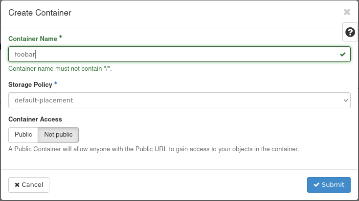

---
#https://gohugo.io/content-management/page-bundles/
title: "Backend for Terraform Statefiles"
type: "docs"
weight: 2
date: 2023-03-14
description: >
  Manage your infrastructure "as code" (IaC) with Hashicorp Terraform and use OpenStack Object Storage as a backend for the Terraform statefiles.
---

## General information about Terraform backends

A backend defines where Terraform stores its state data files.

Terraform uses persisted state data to keep track of the resources it manages. Most non-trivial Terraform configurations either integrate with Terraform Cloud or use a backend to store state remotely. This lets multiple people access the state data and work together on that collection of infrastructure resources.

[Ausführlich Dokumentation zu den Terraform Backends](https://developer.hashicorp.com/terraform/language/settings/backends/configuration)

In the pluscloud open, the integrated object storage is ideal for these status files. The following steps explain how this can be integrated as a backend.

## Prerequisites

To be able to use the object storage, we need a container or bucket in the s3 language, the s3 endpoint and the access data.

### Zugangsdaten

To get your S3 credentials, you need to [configure your OpenStackClient correctly](/en/compute/pluscloudopen/introduction/environments/#credentials-for-cli-tools). Once this is done, you can enter the following command:

```bash
$ openstack ec2 credentials create
+------------+-----------------------------------------------------------------------------------------------------------------------------------------------------+
| Field      | Value                                                                                                                                               |
+------------+-----------------------------------------------------------------------------------------------------------------------------------------------------+
| access     | 5aen4quuuQu8ci7aoceeyaek8oodohgh                                                                                                                    |
| links      | {'self': 'https://prod1.api.pco.get-cloud.io:5000/v3/users/poashohhe9eo8EeQuez3ochaeWaeBoiR/credentials/OS-EC2/5aen4quuuQu8ci7aoceeyaek8oodohgh'}   |
| project_id | Eine8Jai4hohzieShoo1iem0yai7fair                                                                                                                    |
| secret     | iek1aechaequa8pheitahNgeizai3eig                                                                                                                    |
| trust_id   | None                                                                                                                                                |
| user_id    | poashohhe9eo8EeQuez3ochaeWaeBoiR                                                                                                                    |
+------------+-----------------------------------------------------------------------------------------------------------------------------------------------------+
```

Your login details will of course look different (the ones shown above are distorted). Only the values "access" and "secret" are relevant for S3 access. 

### Creating a bucket

Once you have your S3 access data ready, you need to create a storage location for your data. In S3 language, this location is called a "bucket". You can create a bucket either via the web UI (Horizon) or via the command line.

#### Horizon/UI

If you are logged in to the web UI (Horizon), you can navigate to "Object Store" in the left menu and then click on "Containers" (this is what the buckets are called in Horizon): . 
Click on the "+Container" button and enter a name for your new container. Select a storage policy and specify whether your new bucket should be public or only privately accessible (in most cases private). Click on "Create" to create the new bucket. 



The bucket should immediately appear in the container list:


#### Openstack CLI

```bash
$ openstack container create <bucketname>
```

#### AWS CLI

To create a bucket in your Object Storage from the command line, you can use the AWS CLI tool, which should be installed in a virtual Python environment:

```bash
$ → python3 -m venv awscli
$ → . ./awscli/bin/activate
$ → pip3 install awscli
Collecting awscli
  Using cached awscli-1.27.93-py3-none-any.whl (4.0 MB)
Collecting botocore==1.29.93
[...]
Installing collected packages: urllib3, jmespath, six, python-dateutil, botocore, colorama, docutils, s3transfer, pyasn1, rsa, PyYAML, awscli
Successfully installed PyYAML-5.4.1 awscli-1.27.93 botocore-1.29.93 colorama-0.4.4 docutils-0.16 jmespath-1.0.1 pyasn1-0.4.8 python-dateutil-2.8.2 rsa-4.7.2 s3transfer-0.6.0 six-1.16.0 urllib3-1.26.15 
```

With this configuration, you can now create your bucket via the CLI:

```bash
(awscli) $ → aws configure --profile=prod1
AWS Access Key ID [None]: 5aen4quuuQu8ci7aoceeyaek8oodohgh
AWS Secret Access Key [None]: iek1aechaequa8pheitahNgeizai3eig
Default region name [None]: 
Default output format [None]: 
(awscli) → $
```

With this configuration, you can now create your bucket via cli:

```bash
(awscli) $ → aws --profile=prod1 --endpoint=https://prod1.api.pco.get-cloud.io:8080 s3api create-bucket --bucket mytfstate
```

Hashicorp recommends enabling versioning for the bucket to create versioned copies of your terraform.tfstate file. You can activate versioning for your bucket as follows:

```bash
(awscli) $ → aws --profile=prod1 --endpoint=https://prod1.api.pco.get-cloud.io:8080 s3api put-bucket-versioning --bucket mytfstate --versioning-configuration 
(awscli) $ → aws --profile=prod1 --endpoint=https://prod1.api.pco.get-cloud.io:8080 s3api get-bucket-versioning --bucket mytfstate 
{
"Status": "Enabled",
"MFADelete": "Disabled"
}
```

## Terraform setup: Bucket as backend for tfstate

First, export your access key and your secret key as environment variables (AWS_ACCESS_KEY_ID and AWS_SECRET_ACCESS_KEY) to prevent them from being saved on your local hard disk.

    export AWS_ACCESS_KEY_ID='5aen4quuuQu8ci7aoceeyaek8oodohgh'
    export AWS_SECRET_ACCESS_KEY='iek1aechaequa8pheitahNgeizai3eig'

Since there is now a bucket in Object Storage and the access data can be used by Terraform, Terraform can be configured to use it as a backend for the Terraform status.
Please add this part of the backend configuration to your terraform code: 

```go
terraform {
  required_providers {
    openstack = {
      source = "terraform-provider-openstack/openstack"
      version = ">= 1.54.1"
    }
  }
  required_version = ">= 0.13"
  
  backend "s3" {
      bucket = "mytfstate"
      key = "terraform.tfstate"
      region = "us-east-1" 
      endpoint = "prod1.api.pco.get-cloud.io:8080"
      skip_credentials_validation = true
      skip_region_validation = true
      skip_metadata_api_check     = true
      force_path_style = true
  }

}
```

For example, if you have several environments (dev, stage, live), it is advisable to manage a separate state file for each environment. You can do this by outsourcing the configuration of the state file and then defining it during initialization.
To do this, empty the configuration of the backend:

```go
terraform {
  required_providers {
    openstack = {
      source = "terraform-provider-openstack/openstack"
      version = ">= 1.54.1"
    }
  }
  required_version = ">= 0.13"
  
  backend "s3" {}

}
```

Now create a subdirectory in your working directory (called ``env`` here) and save different configurations of the backend in different files.

    env
    ├── backend_s3_dev.tfbackend
    ├── backend_s3_stage.tfbackend
    └── backend_s3_prod.tfbackend

backend_s3_dev.tfbackend:
```go
key                         = "dev/terraform.tfstate"
bucket                      = "mytfstate"
region                      = "us-east-1"
endpoint                    = "https://prod3.api.pco.get-cloud.io:8080"
skip_region_validation      = true
skip_credentials_validation = true
skip_metadata_api_check     = true
force_path_style            = true
```
backend_s3_stage.tfbackend:
```go
key                         = "stage/terraform.tfstate"
bucket                      = "mytfstate"
region                      = "us-east-1"
endpoint                    = "https://prod3.api.pco.get-cloud.io:8080"
skip_region_validation      = true
skip_credentials_validation = true
skip_metadata_api_check     = true
force_path_style            = true
```

With the exported login information, you can now initialize Terraform as follows:

Example of the integrated backend configuration

```bash
$ tform → terraform init

Initializing the backend...

Successfully configured the backend "s3"! Terraform will automatically
use this backend unless the backend configuration changes.

...
$ tform → 
```

Example for the external backend configuration

```bash
$ tform → terraform init -backend-config="env/backend_s3_dev.tfbackend"

Initializing the backend...

Successfully configured the backend "s3"! Terraform will automatically
use this backend unless the backend configuration changes.

...
$ tform → 
```