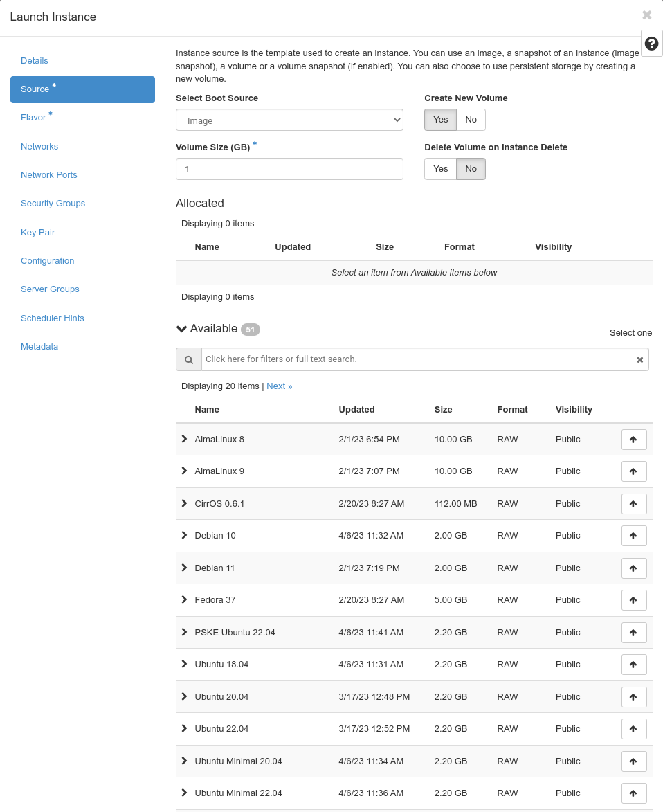
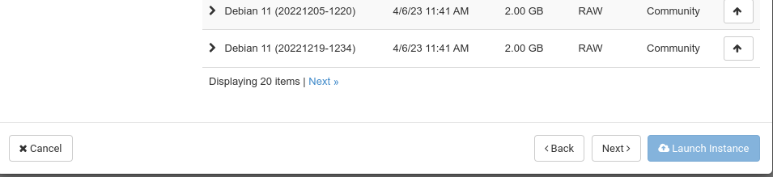
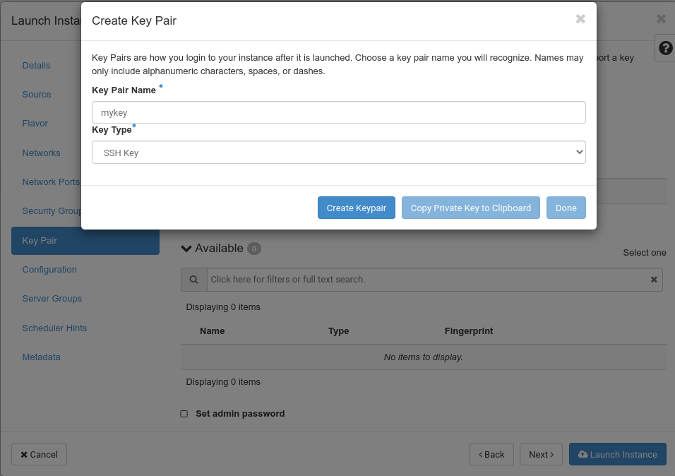
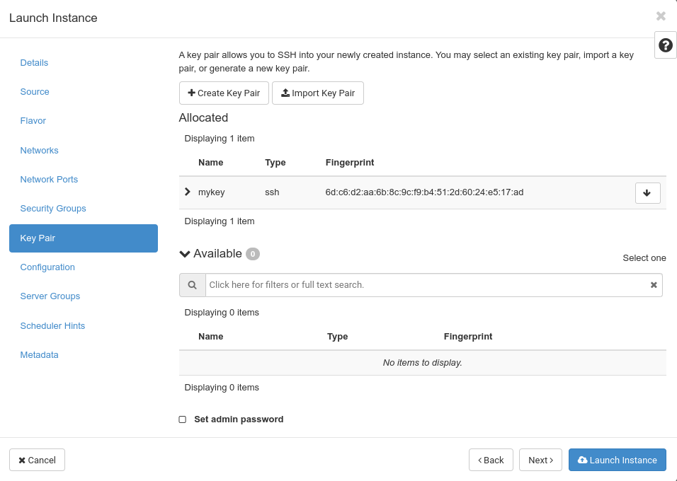
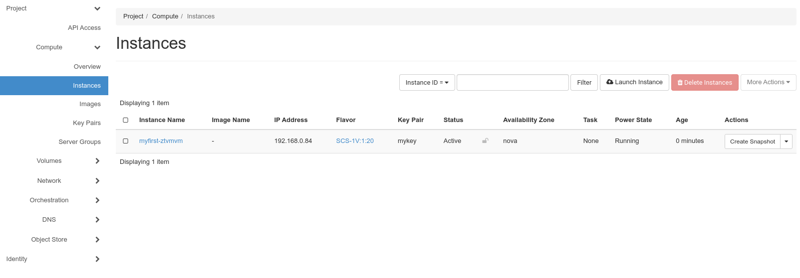
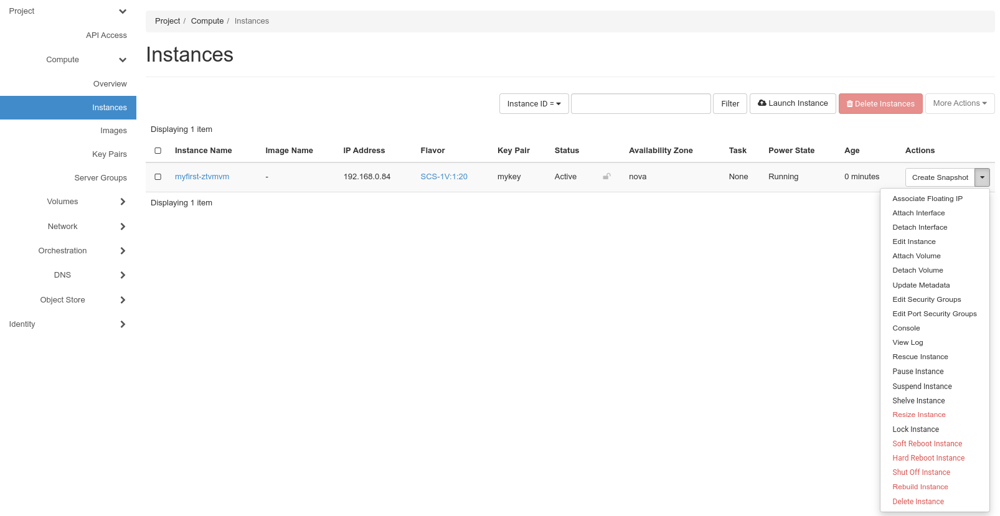

---
#https://gohugo.io/content-management/page-bundles/
title: "From zero to first login into a VM with Horizon"
type: "docs"
date: 2023-03-20
description: >
  Click your first VM in Horizon and log in
---

## Your credentials

After ordering a pluscloud open in one of our regions, you'll receive an e-mail similar to the following:

    Liebe Kundin, lieber Kunde,
    
    Ihre pluscloudopen d123456 ist nun verfügbar unter https://prod1.api.pco.get-cloud.io/
    Zugangsdaten:REGION=prod1
    DOMAIN_NAME=d123456
    PROJECT_NAME=p123456-ztvm
    USERNAME=u123456-projectadm
    PWX_LINK=https://pwx.psmanaged.com/link/agp4513256
    Mit freundlichen Grüßen,
    Ihr pluscloudopen Team.

This e-mail contains all the information you need to connect to your pluscloud open for the first time.

Clicking on ``https://prod1.api.pco.get-cloud.io/`` will open a new tab in your browser and take you to the login screen of pluscloud open.

Here you need the information from the e-mail. You will get your "**password**" by clicking on the "PWX_LINK". This will take you to a web page with another link that you must click to get your user password. In this way, We bypass anti-virus software that detects links in your e-mails and would invalidate a password link. 

Enter the "USERNAME" from the e-mail in the "**User Name**" field, the password from the "PWX_LINK" for the "**Password**" field, and the "DOMAIN_NAME" for the "**Domain**" field.

After clicking on "**Sign In**", you should see pluscloud open web GUI:

## Your first instance

To start you first instance on pluscloud open, click on "**Instances**". This will take you to the "Instances" menu:

As you can see, there are currently no instances deployed. To start your first instance, click on "**Launch Instance**" in the upper right corner. That opens a pop-up, which will guide you through all required steps for creating and starting a new instance.

Asterisks (*) mark required information, thus you need to give your fist instance a name. Enter it in the "**Instance Name**" field and click "Next".

You have to choose the "**Source**" image of your new instance from the list of images.

Select the "**Ubuntu 22.04**" image by clicking on the small "up" arrow at the end of the line. The image will then be listed under "Allocated":

Scroll down to the end of the list and click "Next" again.

You are now in the "**Flavor**" menu where you have to choose a flavor to size your new instance. Select the "**SCS-1V:1:20**" flavor by clicking on the small "up" arrow at the end of the line:

The selected flavor should now be listed under "Allocated":

As you can see, the "**Launch instance**" button has now been activated:

Before launching the instance, first click on "**Key Pair**" which will bring you to the key pair menu:

To log in to the new instance via SSH after it has been launched, you will need an SSH public/private keypair. Click on "Create Key Pair":

Name your new key by entering a name in "**Key Pair Name**" and select "SSH Key" as the "**Key Type**" then click on "Create Keypair":

A new field will appear showing the "**Private Key**" of the newly generated key pair. Click on "**Copy Private Key to Clipboard**", then open your favorite text editor, paste the private key from the clipboard into it, and save it to your local disk. For example, On a Linux system, you would probably open the Vi editor, paste the key there, and save the new file in your home directory. On a Windows system, you could use UltraEdit and also save the new file in your home directory.

After saving the private key to your hard drive, click on "Done". The new key should now be listed under "Allocated":

Now you should launch the instance by clicking on "**Launch Instance**". The "**Instances**" menu will open and show the newly created instance:

Since you want to be able to log in to your new instance, you need to associate a floating IP address with it. You can do this by clicking the small "down" arrow under the "**Actions**" menu:

Select "**Associate Floating IP**" to open the following dialog:

As you have not allocated any floating IP addresses yet, you need to click on the small "+" in the "**IP Adress**" field to allocate one:

Leave the "**Pool**" menu untouched and enter a "**Description**" in the respective field. Then click on "**Allocate IP**".

As you have allocated a floating IP address - now you can click on "**Associate**" in order to associate it with your new instance.

Now the "**Instances**" menu should show your newly created instance with the just allocated, public IP address. You should be able to connect to this new instance by using the private SSH key we created earlier. On a Linux system, you would probably first adjust the permissions of the private key file you saved before:

    $ chmod 0600 /var/tmp/id.rsa.priv

Otherwise, you would get an error message about `bad permissions` when you try to use the key. After adjusting the permissions, you should be able to log in:

    $ ssh -l ubuntu -i /var/tmp/id.rsa.priv 213.131.230.236
    Welcome to Ubuntu 22.04.2 LTS (GNU/Linux 5.15.0-67-generic x86_64)
    
     * Documentation:  https://help.ubuntu.com
     * Management:     https://landscape.canonical.com
     * Support:        https://ubuntu.com/advantage
    
      System information as of Mon Apr 24 14:56:26 UTC 2023
    
      System load:  0.1357421875      Processes:             92
      Usage of /:   7.5% of 19.20GB   Users logged in:       0
      Memory usage: 19%               IPv4 address for ens3: 192.168.0.84
      Swap usage:   0%
    
     * Introducing Expanded Security Maintenance for Applications.
       Receive updates to over 25,000 software packages with your
       Ubuntu Pro subscription. Free for personal use.
    
         https://ubuntu.com/pro
    
    Expanded Security Maintenance for Applications is not enabled.
    
    0 updates can be applied immediately.
    
    Enable ESM Apps to receive additional future security updates.
    See https://ubuntu.com/esm or run: sudo pro status
       
    
    The list of available updates is more than a week old.
    To check for new updates run: sudo apt update
    
    
    The programs included with the Ubuntu system are free software;
    the exact distribution terms for each program are described in the
    individual files in /usr/share/doc/*/copyright.
    
    Ubuntu comes with ABSOLUTELY NO WARRANTY, to the extent permitted by
    applicable law.
    
    To run a command as administrator (user "root"), use "sudo <command>".
    See "man sudo_root" for details.
    
    ubuntu@myfirst-ztvmvm:~$

Congratulations. You have just created your first instance on pluscloud open and logged into it via SSH. 
