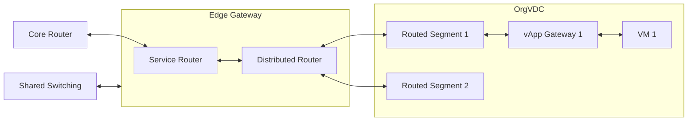

Pluscloud VMware has various systems that take over routing tasks:

## Core router

The core routers are high-performance physical router systems that are redundantly available at each plusserver data center
(see []()).
They provide the connection between the data centers and the internet, for which various peerings with communication service providers exist.

The core routers are not exclusively part of the pluscloud VMware but are part of the plusserver network infrastructure.

## Edge Gateway

An edge gateway is used to connect organizational networks to external networks (see []()).

An edge gateway is provisioned for each OrgVDC.
This consists of a service router and a distributed router.

### Service router

The service router contains all non-distributed services of the edge gateway.
This includes in particular

* the gateway firewall
* the NAT engine for SNAT and DNAT
* the DHCP server
* the VPN gateway
* the IPAM for managing IP addresses

### Distributed Router

The distributed router is a service of the edge gateway that is distributed across all virtualization hosts.
It serves all static and dynamic routes within the pluscloud VMware environment.

{}
**Data path for distributed routing**  
If a connection can already be realized via the distributed router, the data traffic is not routed via the service router.
The services running there, including the gateway firewall, are therefore bypassed, as the data traffic does not pass through them.

For this reason, you cannot use the gateway firewall to separate different segments from each other.
{}

## vApp Gateway

A vApp gateway is used to connect vApp networks and org networks (see []()).

It is only used when a vApp network is routed to an org network.
A gateway is not required as a routing instance for a directly connected vApp network, as the network segment is passed through unchanged.
An isolated vApp network does not require a gateway because it is not connected to any other network.

The vApp Gateway's NAT and firewall functionalities are limited to a minimum.
