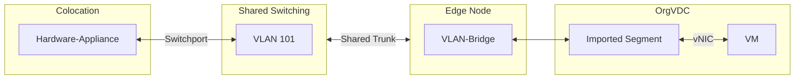

With the pluscloud VMware, it is possible to integrate a  in the form of a virtual network segment.
This makes it possible to integrate a hardware system into the virtual infrastructure.
This allows you, for example, to integrate a hardware appliance or a hardware server into an otherwise virtual infrastructure and to migrate it gradually or operate it in parallel.

We recommend that you use this option restrictively.
We recommend that you use connectivity at   layer 3 (network layer /  level) as a priority.

{}
**No Self-Service possible**  
VLAN bridging can currently only be set up by plusserver employees.  
Please contact the support channels you are familiar with.
{}

## Technical implementation

The network virtualization of the pluscloud VMware is done with NSX-T.
This relies on encapsulation of network communication.
When moving from the physical infrastructure to the virtualized world, the frames of the  segment must also be encapsulated.
To do this, a  bridge is set up on an edge node, which performs the packing and unpacking of the frames.

The following graphic shows  bridging using the example of a hardware appliance:

A hardware appliance in the colocation area of the data center is connected to the shared switching infrastructure via a switch port.
A  is configured for this connection, which in this example is given the - 101.

The shared switching infrastructure is connected to so-called edge nodes, which are part of the pluscloud VMware.
These are dedicated servers that handle communication between the cloud infrastructure and systems outside the cloud.
No customer workload is executed on these servers.
Instead, routing instances, gateways and  bridges are operated here.

A separate  bridge is configured for each  to be integrated.
This can be thought of as a switch that is connected to the  to be connected with one port and whose other port is connected to the virtual segment.

The VLAN is then available within an  as an imported segment. Virtual network interfaces (s) can now be connected to this segment.

## Performance

   bridging is offered on a best-effort basis.
This means that there is no guarantee of specific availability, bandwidth or latency for this service.
The values listed here are therefore only intended as a guide and may be exceeded or undercut in the short or long term.

| Value               | Limit                                                           |
|---------------------|-----------------------------------------------------------------|
| Latency             | typically 700µs to 2000µs with peak values up to 5000µs         |
| RTT VM to hardware  | typically 1ms to 5ms, with peak values up to 10ms               |
| Bandwidth           | maximum 1000 Mbit/sec                                           |
