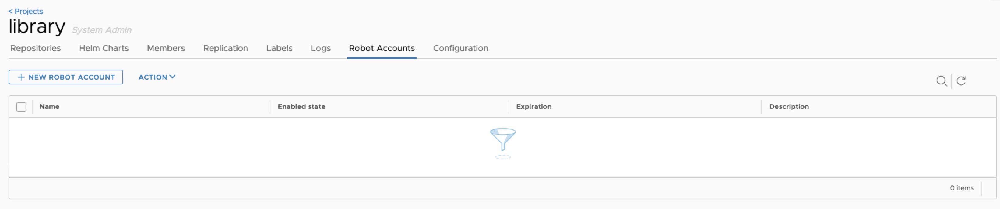

### Note

In the following, two demo instances (nodes) of the Harbor Private Registry are used. For the replication of 2 Harbor Private Registry instances, you first need the two registries with the corresponding accesses.

For this example, we assume the following instances:

node-6479baa42aa93122c93cb3bc.ps-xaas.io
node-67077b8f576fd34a91ee556c.ps-xaas.io

### General

There are two methods for setting up replication under Harbor: pull and push.

- Pull: Data is “pulled” for replication from a second Harbor instance, i.e. an inbound replication
- Push: data is “pushed” from one Harbor instance to a second Harbor instance

Which of these methods you choose depends on the network design and the actual purpose of the replication.

In this example, we assume “push-based” and an already existing (and not empty) repository on a site from which data is to be “pushed”.

In this specific example, a push from node-6479baa42aa93122c93cb3bc.ps-xaas.io to node-67077b8f576fd34a91ee556c.ps-xaas.io.

### Setting up a robot account

First you have to set up a so-called robot account on the opposite side, i.e. on node-67077b8f576fd34a91ee556c.ps-xaas.io. This is used so that the source instance, from which the data is pushed to the target instance, can log in there and “pull” and “push” repositories there.

To do this, log in to the Harbor web interface of the “target instance” with the corresponding admin access.

To do this, go to the corresponding project (new creation parallel to the original instance if not yet available) under “Projects” and then select the “Robot Accounts” tab.

Here you select “+ New Robot Account”, give the account a name, a short description and an expiration date. If the account is to be permanently active, you would select “Never” here. For Permissions, select “Push” and “Pull” under Repository.

When you complete the creation of the account, you will be given the following information: Name and Secret. Copy both and click “Export to File” for archiving. Important: this information is only displayed once. If you lose the data, it must be deleted and created again.

### Setting up a new endpoint on the source side

Armed with this information, you can make the target instance known to the Harbor Push instance.

To do this, log in to the Harbor web interface of the “push instance” (the one with the existing repository) with the corresponding admin account.

Then go to “Registries” and click on “+ New Endpoint”.

There is a whole range of providers here, but for our case, which involves replication between two Harbor instances, “harbor” is selected as the provider.

Then give the endpoint a name, e.g. the actual node name of the target instance, in our case “node-67077b8f576fd34a91ee556c.ps-xaas.io” and optionally enter a short description. For our example, enter “<https://node-67077b8f576fd34a91ee556c.ps-xaas.io>” for Endpoint URL and the data of the robot account previously created on the other node for Access ID and Secret.

Then click on “Test Connection” and if the firewall is activated and all entries have been made correctly, then this test is successful and you can close the window again with “OK”.

Now all the requirements have been met to set up the actual replication.

### Setting up the replication

To do this, go to “Administration -> Replications” in the menu on the left.

There you go to “New Replication Rule”, give the rule a meaningful name under “Name”, which directly shows you exactly what it is. In this example, the name is just “rule”, which is absolutely not suitable for productive use.

Under “Description” it is best to briefly and concisely describe what this replication is intended for and under “Replication mode” select the appropriate method (see above). In this example it is “Push-based”, i.e. an outgoing replication to the other node.

Under “Source resource filter” you can specifically define what is to be replicated. This can be done as follows:

- Name: Replicate resources with a specific image name or only part of the name.
- Tag: Replicate resources only with a specific tag or only part of the tag.
- Label: Only replicate resources with a specific label. These are available in a drop-down list if they have been set beforehand.
- Resource: Replicate only images, charts or both

For a detailed description of the possible filters, please follow the official instructions (see below).

Then select the previously configured endpoint under “Destination Registry”, in our case the “node-67077b8f576fd34a91ee556c.ps-xaas.io” and, if you want/need to, a separate namespace under “Destination namespace” where the replication should take place. In our example, we leave this empty.

Under “Trigger Mode” you can choose between the following options:

- Manual: Replicate resources manually only. Delete operations are not replicated here.
- Scheduled: Periodic replication according to a previously defined schedule. Delete operations are not replicated here.
- Event Based: Only perform replication when certain previously defined events occur. A delete operation is also carried out here if configured accordingly.

For a detailed description of the possible options, please follow the official instructions (see below).

In our example, we select “Scheduled” and specify a schedule. Confusingly, this is defined in a similar way to a cron job, but indirectly has a few more options. You can find more details here if you click on the (i) with the mouse to the right of the input field.

In general, it doesn't make much sense to enter “seconds” as the first field, because the first field, seconds, MUST be 0 and the second, minutes, must not be 0. So basically, you could have simply left it out. But it is what it is.

You also have the option of limiting the bandwidth used and using the “override” to determine whether you should/may simply overwrite resources with the same name on the target page. You can also set whether the copy job should also take place “by chunk”, i.e. “chopped up” into smaller parts, which can, however, generate a higher load on the API under certain circumstances.

If you want the rule to be directly active, check the “Enable Rule” box and save the setting via Save.

Now you can either wait until the schedule is executed and then tick the replication created under “Replications” and check the execution below under “Executions” or, if you want to execute the replication directly, also select it and click on “Replicate” at the top right next to “New Replication Rule”. Its execution can then also be observed under “Executions”.

If the replication was successful, you can now see the replicated objects on the target page.

Official instructions at: <https://goharbor.io/docs/1.10/administration/configuring-replication/>
