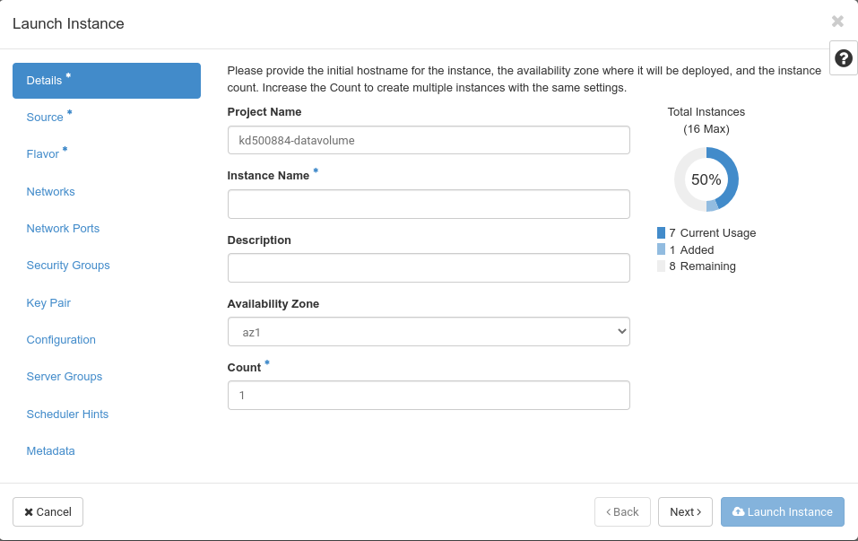
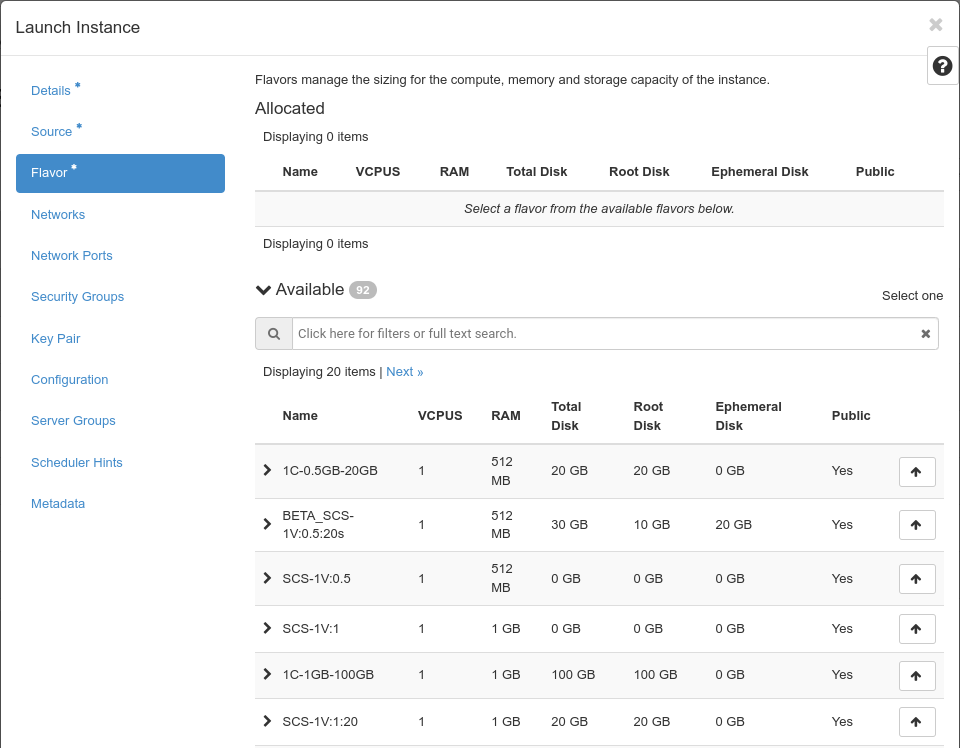

## Launch Instance
Using the button "Launch Instance" you can create one or more new instances and start them. An guided dialogue helps you to go through all required steps. As soon as you have entered enough information for launching an instance the button "Create Instance" becomes available and you can start your new instance(s). Asterisks (*) mark required information.

Keep in mind that shell access to the new instance is only possible via ssh key authentication. Thus you either need to create a ssh keypair during instance creation or upload your keypair beforehand. 
Clicking on "**Launch Instance**" opens a dialogue, which will guide you through several steps, which have to be completed to launch an instance:

As usual Asterisks (*) mark required information and as soon as enough information has been entered, the "**Launch instance**" button will be activated.

You need to give your new instance a name in the "**Instance Name**" field. The description is optional. There is only one "**Availability Zone**" you can choose. You can use the "**Count**" field to spawn serveral instances of the same type at the same time.

"Next" you should define the "**Source**" of your instance. Basically you choose, what image your instance should be based on. 

First you choose whether your new instance should be booted from an image (and you see a list of the items available to you under "**Available**"), from an instance snapshot, from a volume or from a volume snapshot. If you choose an existing volume, you can only boot one instance from it. If you choose an image or a snapshot, you can boot more than one instance from it. You choose the item you want by clicking on on the little "up" arrow on the right.

Next you define the "**Volume Size**" of the root volume of your new instance. If you set no value here (or one which is too small), the size will automatically adjusted to the size of the image you choose. 

The options on the right side ("**Create New Volume**" and "**Delete Volume on Instance Delete**") determine the lifecycle of the root volume of your instance. If you want, that your instance and its root volume are deleted when the instance is deleted, you should choose not to create a new volume (the option to delete the volume on instance delete will be deactivated). If you have chosen to create a volume, you can choose to have the volume deleted on instance deletion. If you don't choose this option, the root volume of the instance will "survive" the deletion of the instance (and consume storage and be billed).

Now - by clicking on "Next" - you have to choose the "**Flavor**" of your new instance. "Flavors" determine the "dimensions" of your new instance regarding the number of virtual CPUs, the amount of virtual memory and the size of the root disk. 

Clicking on the little arrow on the left - in front of each flavor line - shows what impact the choice of that flavor has on your consumption. By clicking on the "up" arrow you choose to use the flavor for the instance creation. If the choice of a flavor would consume more resources than available in your quota, it is marked with a yellow "warning" exclamation mark.

Pluscloud open is in charge of the creation an management of the flavors.s

Next you need to choose the "**Networks**" you want your new instance to be connected to.

Depending on your network topology you would choose one or more networks from the networks listed under "**Available**".

"**Security Groups**" allow you to choose which security groups should be applied for your new instance.

The "default" security group would allow for basic access to your instance. Additional security groups could (dis)allow traffic to and from specific networks or specific ports. If you remove the default security group, you will only be able to access your new instance via VNC console.

The "**Key Pair**" menu allows you to generate a new ssh public/privatey key pair by clicking on "Create Key Pair" or to import a key pair you already have with "Import Key Pair" in order to be able to login to your new instance via secure shell (ssh).

If you create a key pair, you are presented with the _private_ key, which you should save to your local workstation and protect from eavesdropping through third parties. The public half of the key pair is saved in your OpenStack project. If you choose to import a "key pair" you actually only import the _public_ part of your key pair. The private key remains in your posession. 

You can also quickly create a new public/private key pair on the command line with ``ssh-keygen -t rsa -f cloud.key`` and then import the public key ``cloud.key.pub`` into your OpenStack project.
If you are using Windows you would use PuttyGen to do the same - just be sure to choose ``openssh`` as the key format.

"**Configuration**" is a menu, that allows you to upload and execute a script, that can be used to customize your instance after launch.

As many cloud images use [cloud-init](https://cloudinit.readthedocs.io/en/latest/) for customization nowadays, this option might be used a little less common than usual.
Another option here is "**Disk Partition**", which can be done "automatic" and "manual". "Automatic" basically creates one partition per volume. With "manual" you can create more partitions per volume.

With "**Server Groups**" you can assign your new instance to an existing server group in order to let your new instance be created either next to other instances in that server group or explicitly not next to other instances in that group (affinity - anti-affinity).

Server groups can have affinity, anti-affinity, soft-affinity and soft-anti-affinity policies. While the affinity policy will fail (and not create the instance), when it cannot place the new instance next to an existing instance of that server group, the soft-affinity policy will place the new instance not next to an existing instance of that server group, if it is not possible (but create the new instance anyway).

If you want to add some "**Scheduler Hints**" in order to affect the placement of your new instance you can either choose from the existing metadata catalog or create your own keys in the first line of the left side.

Just click "+" on a key from left to move it to the right in order to assign it to the new instance. Additional information is displayed in the box at the bottom of the menu.

Similar to this, you can add (more) metadata to your new instance in the "**Metadata**" menu.

There is a catalog of already existing metadata available. But you can create your own keys in the "Custom" field, too.
Just click "+" on the the wanted item on the left to move it to the right.