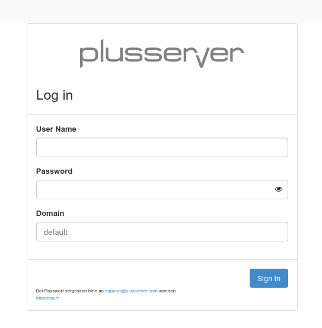
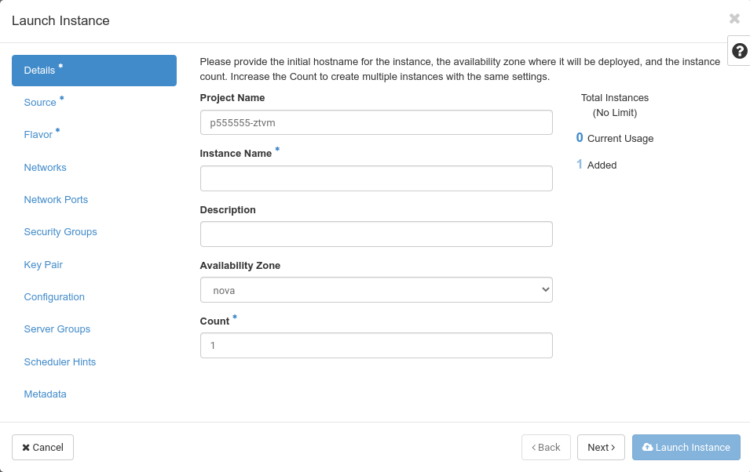
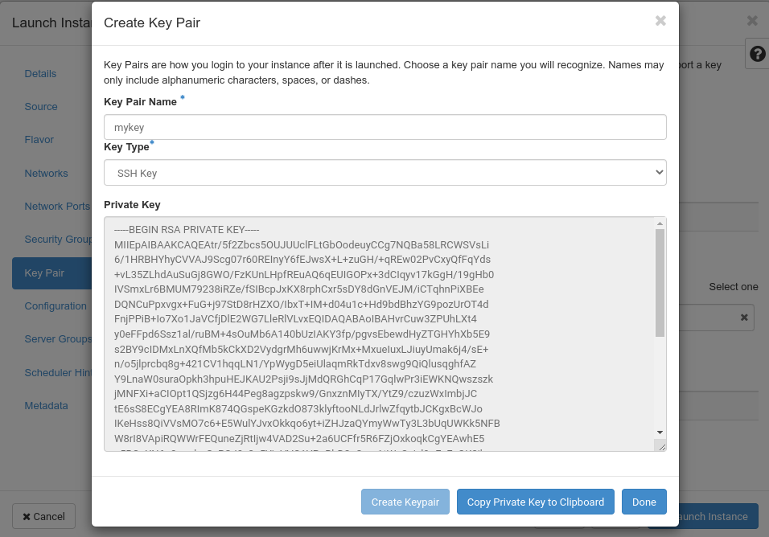
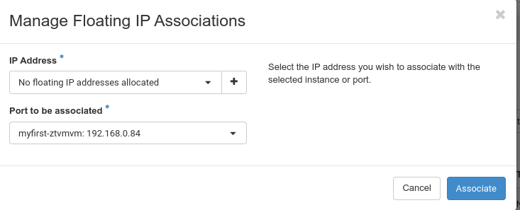

---
#https://gohugo.io/content-management/page-bundles/
title: "From zero to first login into a VM with Horizon"
date: 2023-03-20
description: >
  Click your first VM in Horizon and log in
---

## You get your credentials via E-Mail

After ordering a cloud in one of our regions, you'll receive an e-mail similar to the following:

    Liebe Kundin, lieber Kunde,
    
    Ihre pluscloudopen d123456 ist nun verfügbar unter https://prod1.api.pco.get-cloud.io/
    Zugangsdaten:REGION=prod1
    DOMAIN_NAME=d123456
    PROJECT_NAME=p123456-ztvm
    USERNAME=u123456-projectadm
    PWX_LINK=https://pwx.psmanaged.com/link/agp4513256
    Mit freundlichen Grüßen,
    Ihr pluscloudopen Team.

This e-mail includes all information you need to connect to pluscloud open for the first time.

Clicking on ``https://prod1.api.pco.get-cloud.io/`` will open a new tab in your browser and take you to the login screen of pluscloud open.

Now you can make use of the information from the e-mail. You can acquire your "**Password**" by clicking on the "PWX_LINK". This will lead you to a webpage with another link, which you should click on to get the password for the user. We do that to work around anti-virus software, which follows links in your e-mails and would render a password link invalid. 

Enter the "USERNAME" value from the e-mail in the "**User Name**" field, use the password from the "PWX_LINK" for the "**Password**" field and try the "DOMAIN_NAME" for the "**Domain**" field.

Click on "**Sign In**" and you should be logged in to the web gui of pluscloud open.

## Your first Instance

In order to start you first instance on pluscloud open you should click on "**Instances**". That should bring you to the "Instances" menu

As you can see, there are currently no instances deployed. To start your first instance, click on "**Launch Instance**" at the upper right corner. 
That opens a pop-up, which will guide you through all required steps creating and starting a new instance.

Asterisks (*) mark required information, thus you need to give your fist instance a name. Enter it in the "**Instance Name**" field and click "Next".

You have to choose the "**Source**" image of your new instance from the list of images.

Choose the "**Ubuntu 22.04**" image by clicking on the little "up" arrow at the end of the line. As soon as you have clicked, the image is now listed under "Allocated"

Scroll down to the end of the list and click "Next" again.

You are now in the "**Flavor**" menu where you have to choose a flavor to size your new instance. Choose the "**SCS-1V:1:20**" flavor by clicking on the little "up" arrow at the end of the line.

Now the flavor you chose, should be listed under "Allocated"

As you can see, the "**Launch instance**" button has now been activated.

But before launching the instance please click on "**Key Pair**" first, which brings you to the key pair menu.

In order to login to the new instance via ssh after it has been launched, you need an ssh public/private keypair. Click on "Create Key Pair"

Name your new key by entering a name in "**Key Pair Name**" and choose "SSH Key" as the "**Key Type**" then click on "Create Keypair"

A new field appears, which shows the "**Private Key**" of the newly generated key pair. Click on "**Copy Private Key to Clipboard**", then open your favourite text editor, paste the private key from the clipboard into it and save it to your local disk. On a Linux system you probably would open the Vi editor, paste the key into it and save the new file in your home directory. On a Windows system you would probably use Ultraedit and save the new file to you home directory, too.

After saving the private key to your disk, click on "Done". The new key should now be listed under "Allocated"

Now you should launch the instance by clicking on "**Launch Instance**". The "**Instances**" menu opens and shows the newly created instance.

As you want to log in to your new instance, you have to associate a floating IP address with it. You can do that by clicking on the little "down" arrow under the "**Actions**" menu.

Choose "**Associate Floating IP**" which will open the respective dialogue

As you have no floating IP addresses allocated so far, you have to click on the little "+" in the "**IP Adress**" field in order allocate one.

Leave the "**Pool**" menu untouched and enter a "**Description**" in the respective field. Then click on "**Allocate IP**".

As you have allocated a floating IP address - now you can click on "**Associate**" in order to associate it with your new instance.

Now the "**Instances**" menu should show your newly created instance with the just allocated, public IP address. Now you should be able to connect to that new instance by using the private ssh key we created before.
On a Linux system, you would probably first adjust the permissions of the private key file you saved before

    $ chmod 0600 /var/tmp/id.rsa.priv

Otherwise you would get an error message about `bad permissions`, when you try to use the key. Having adjusted the permissions, you should be able to log in

    $ ssh -l ubuntu -i /var/tmp/id.rsa.priv 213.131.230.236
    Welcome to Ubuntu 22.04.2 LTS (GNU/Linux 5.15.0-67-generic x86_64)
    
     * Documentation:  https://help.ubuntu.com
     * Management:     https://landscape.canonical.com
     * Support:        https://ubuntu.com/advantage
    
      System information as of Mon Apr 24 14:56:26 UTC 2023
    
      System load:  0.1357421875      Processes:             92
      Usage of /:   7.5% of 19.20GB   Users logged in:       0
      Memory usage: 19%               IPv4 address for ens3: 192.168.0.84
      Swap usage:   0%
    
     * Introducing Expanded Security Maintenance for Applications.
       Receive updates to over 25,000 software packages with your
       Ubuntu Pro subscription. Free for personal use.
    
         https://ubuntu.com/pro
    
    Expanded Security Maintenance for Applications is not enabled.
    
    0 updates can be applied immediately.
    
    Enable ESM Apps to receive additional future security updates.
    See https://ubuntu.com/esm or run: sudo pro status
       
    
    The list of available updates is more than a week old.
    To check for new updates run: sudo apt update
    
    
    The programs included with the Ubuntu system are free software;
    the exact distribution terms for each program are described in the
    individual files in /usr/share/doc/*/copyright.
    
    Ubuntu comes with ABSOLUTELY NO WARRANTY, to the extent permitted by
    applicable law.
    
    To run a command as administrator (user "root"), use "sudo <command>".
    See "man sudo_root" for details.
    
    ubuntu@myfirst-ztvmvm:~$

Congratulations. You have just created your first instance on pluscloud open and logged into it via ssh. 
