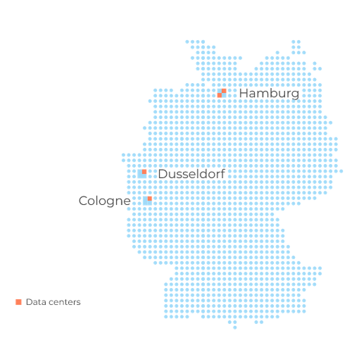

plusserver offers multiple Regions and Availability Zones (AZs) to provide customers with high availability and disaster recovery options.

## What is a Region?

A Region is a geographic area that consists of several isolated and physically separated, therefore redundant, AZs. The distance between regions is >=300km.

## What is an Availability Zone (AZ)?

An Availability Zone (AZ) is a location within a Region consisting of one or more data centers designed to be independent of one another, providing redundancy in case of failures or disasters.

### Requirements

* Data centers in an AZ share at least one common power, network, and cooling supply.
* An AZ is always independent of another, especially in the areas of power (input, distribution, UPS, emergency power), network (input, router, switches), cooling and buildings.
* Network Latency between the AZs within the same region is <=2ms

## plusserver Region and Availability Zone

The following table lists the regions and AZs offered by plusserver

| Region   | Availability Zone | Location            |
|----------|-------------------|---------------------|
| DE-NORTH | DE-NORTH-1        | Hamburg, Germany    |
|          | DE-NORTH-2        | Hamburg, Germany    |
| DE-WEST  | DE-WEST-1         | Cologne, Germany    |
|          | DE-WEST-2         | Dusseldorf, Germany |

### Locations and data centers

