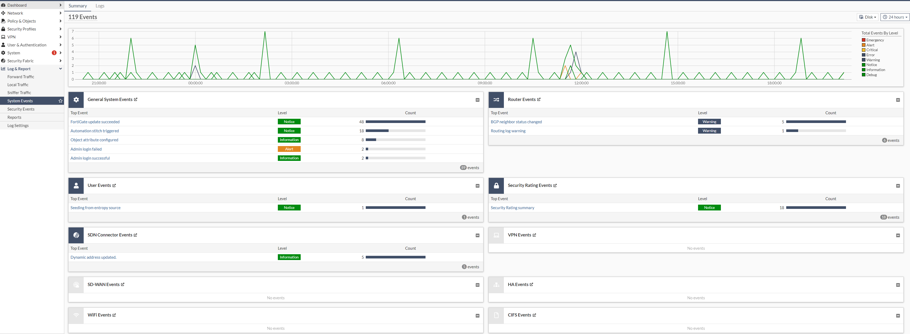

## First steps with your Virtual Cloud Firewall

### Provisioning the virtual machines (VM)

The entire provisioning process is automated and you will receive the corresponding access data after successful completion. You can then immediately access your Virtual Cloud Firewall.

The two firewalls are provided in a parallel service project on the pluscloud vmware. In your client, you can only see the part with the "*_internal" networks.


Your cluster or the virtual machines have the prefix **fw** and can be accessed externally via the specified public IP address after the provisioning process.

Here is another view of the instances that are provided for you. These are also not visible to you due to the provisioning in the parallel service project. The graphic is for overview purposes only.


Further information on handling your pluscloud vmware instance can be found at the following link:
[pluscloud vmware](https://docs.plusserver.com/de/compute/pluscloudvmware/)

### First login

The access data will be sent to you by e-mail via our password tool: pwx. You will find the necessary information and instructions for logging in in the corresponding e-mail.

You can access your Virtual Cloud Firewall via the following protocols:

* HTTPS (TCP/443)
* SSH (TCP/22)

Here is an example of a login screen:


#### Note on the SSL certificate

You should replace the SSL certificate with a (valid) public certificate. You can also use the in-built ACME mechanism, which issues a corresponding certificate.

Further information can be found here:
[Automatically provision a certificate](https://docs.fortinet.com/document/fortigate/7.4.0/administration-guide/822087/automatically-provision-a-certificate)

### Basic configuration

After successfully logging in to your Virtual Cloud Firewall instance, you have read-only access or full access to the administrative web interface, depending on the management level you have booked.


In the Full Management management level, you can carry out further configuration or customisations here as usual.

#### Management Access to the Virtual Cloud Firewall instance via a VPN (Virtual Private Network) connection

Administrative access to your Virtual Cloud Firewall instance can be secured using an additional VPN tunnel. To do this, you can configure an additional tunnel with the corresponding parameters:


#### Routing configuration

Various routes are set up when the Virtual Cloud Firewall is provided. These routes are used for basic communication within the pluscloud vmware infrastructure and the connection to the Internet.

You can display the currently set routes in the command-line interface (CLI) with the following command:

```console
get router info routing-table all
```

Here is an example:


#### Checking the internet connectivity

You can deploy a test VM behind the Virtual Cloud Firewall for basic internet connectivity checks. You can also use this to check any NAT rules and security policies.

Here is an example with a test VM:


And here is an example with a test VApp:


In the VM, you can perform a ping or traceroute to a known website (e.g. *www.google.com* ) to test the Internet connection.

#### Performance data and logging

Under the "Log & Report" section, you can view various parameters for performance, security and the corresponding logs (here is an example from the "System Events"):

