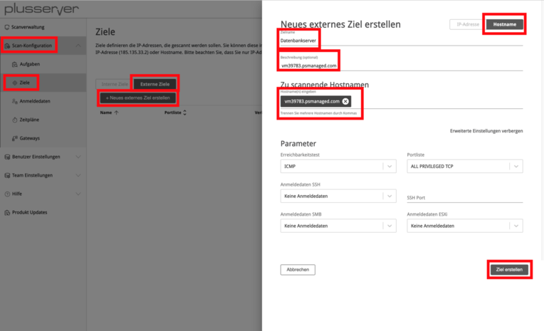
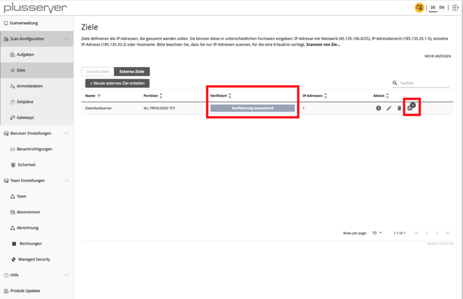
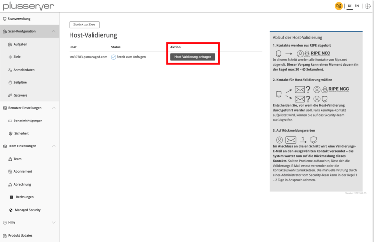
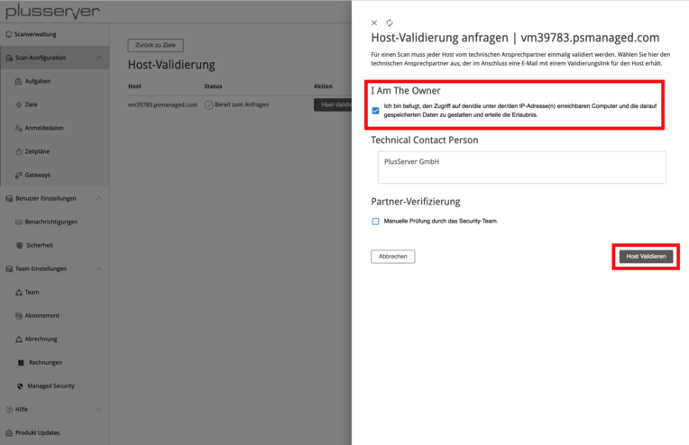
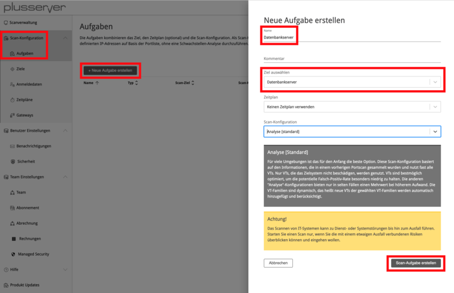
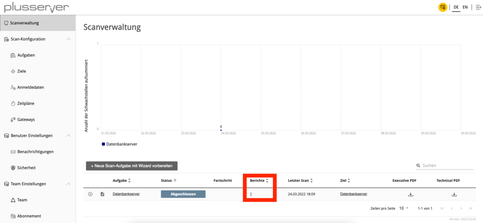
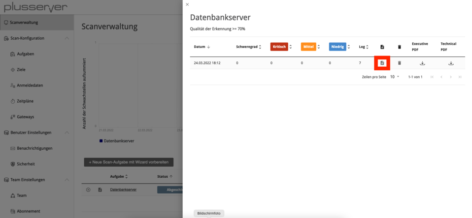
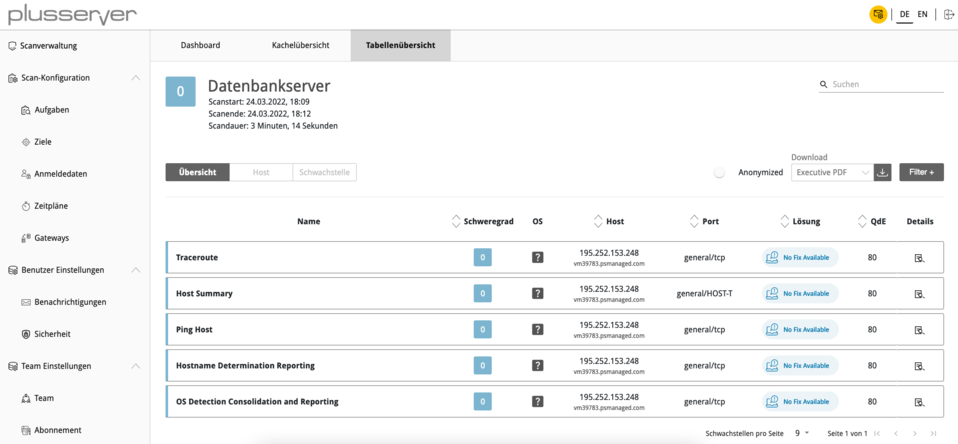

# Security Scanner - Quickstart Guide

## Contents
1. [Quick Start](#quick-start)
2. [Creating and Validating Targets](#creating-and-validating-targets)
3. [Creating and Starting Scan Tasks](#creating-and-starting-scan-tasks)
4. [Viewing & Analyzing Vulnerability Reports](#viewing--analyzing-vulnerability-reports)

## 1. Quick Start

This document serves as a quick introduction to the Vulnerability Scanner and its associated self-service functions. This article provides step-by-step guidance on how to set up a complete scan task after initial login. This document assumes that you already have your access credentials (username and password) as well as your tenant URL. With this data, you can directly access the tenant portal. Additionally, it is helpful to have the IP addresses that need to be scanned. These can also be viewed in the plusserver customer portal.

## 2. Creating and Validating Targets

Navigate to the Targets submenu via the Scan Configuration menu item. The overview is divided into Internal and External Targets. Internal targets are isolated networks (e.g., Class C networks like 10.0.0.0/8) that cannot be reached via the Internet. Internal targets can only be reached via the Vulnerability Scanner Gateway. External targets have a public IP address (e.g., 1.1.1.1) which can be reached directly via the Internet by the Vulnerability Scanner.

To create a target, click on "Create New External Target". Then enter a name and specify the system to be scanned. Under "Show Advanced Settings", you have the option to configure the ports to be checked, the reachability test, and credentials for authenticated checks. After saving the target via "Create Target", the entry will be displayed in the overview.

Before the vulnerability scan can be started, verification is necessary to prevent misuse of IP-based system scanning. To do this, click on the last icon under the "Action" column.

In the next step, validation is initiated using "Request Host Validation". There are three options available:

1. **I am the owner**: Select this option whenever the IP address is assigned to your organization and you are therefore authorized to perform a vulnerability assessment. Please make sure to select this option if you are scanning IP addresses of your systems at plusserver! If you choose other options in this case, unnecessary delays will occur.

2. **Technical Contact Person**: If you are not the owner of the IP address but have been commissioned to perform a vulnerability assessment, please use this option. An email request will be sent to the email address stored in the RIPE entry. The owner must confirm this request before the vulnerability assessment can be carried out. This process may take some time - please consult with the owner if necessary.

3. **Partner Verification**: This option is not intended for validation.

## 3. Creating and Starting Scan Tasks

With the previously created target, you can now create a scan task and incorporate it. In the "Name" field, you can use the same name that you assigned to the target if desired. Under "Select Target", specify the desired target.

The vulnerability scan can now be started. To do this, switch to the scan task overview via the "Scan Management" menu item. Click on the icon to start the scan task.

## 4. Viewing & Analyzing Vulnerability Reports

Once the vulnerability scan has been successfully completed, the status of the scan task changes to "Completed". To view the vulnerability report, click on the number within the "Reports" column.

You will now see an overview of all completed vulnerability scans. Click on the icon to access the vulnerability report.

You have various options for displaying and processing the list of vulnerabilities. This includes tile and table views as well as export as PDF or XML document.

**Important note for plusserver IP addresses**: 
Make sure to select the "I am the owner" option during host validation to avoid unnecessary delays.

