# Security Scanner - Scanning Internal IP Addresses with the Gateway

## Introduction

Since not all IP addresses in your infrastructure can be checked externally, you have the option to set up a gateway. This allows isolated networks (e.g., RfC-1918) to be checked for vulnerabilities.

# Installing Gateway

## Download Gateway Image

Navigate to https://sec-scan.psmanaged.com/ui/gsp/entities/gateway/list/. There, select the available platform and download the image.

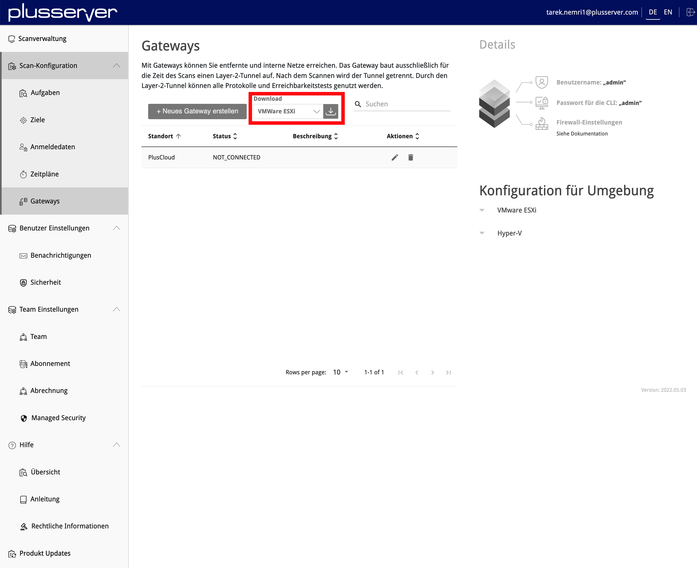

## Upload Image to the vAPP Template Catalog of your PlusCloud

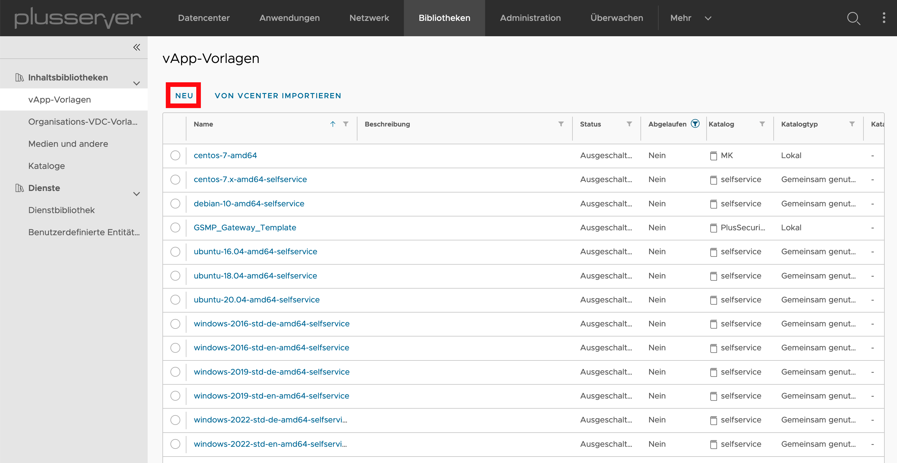

## Create New Virtual Machine

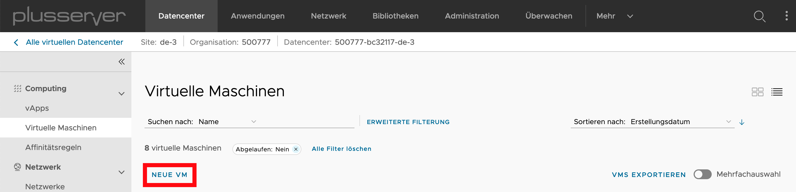

## Specify VM Hostname and Select Template

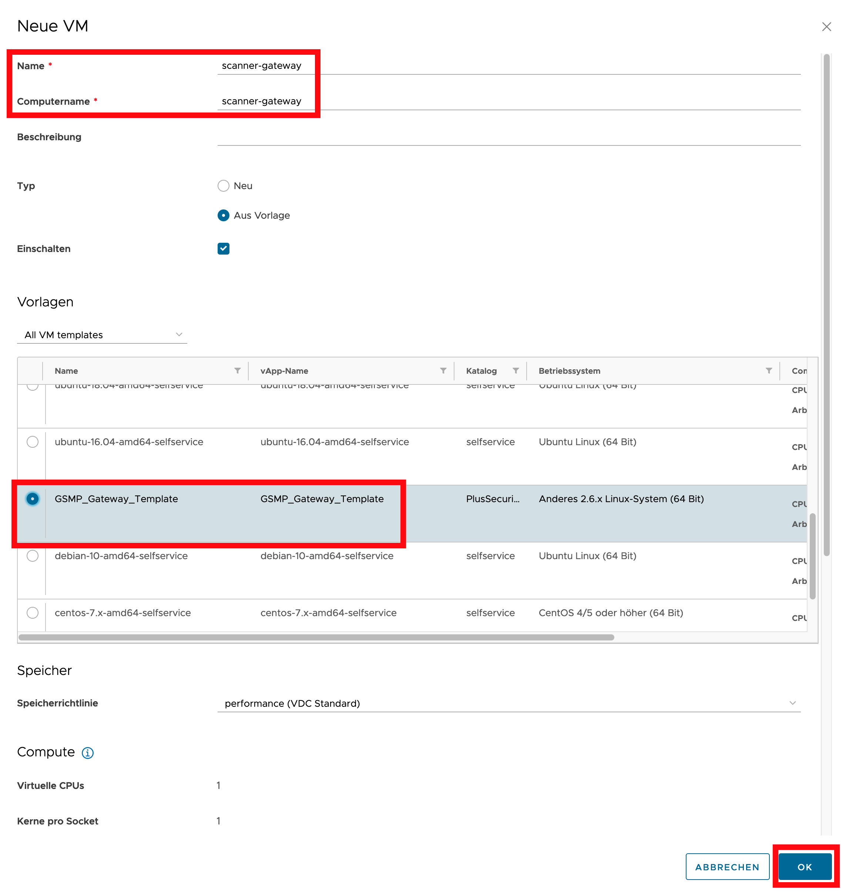

## Configure Network & IP Address

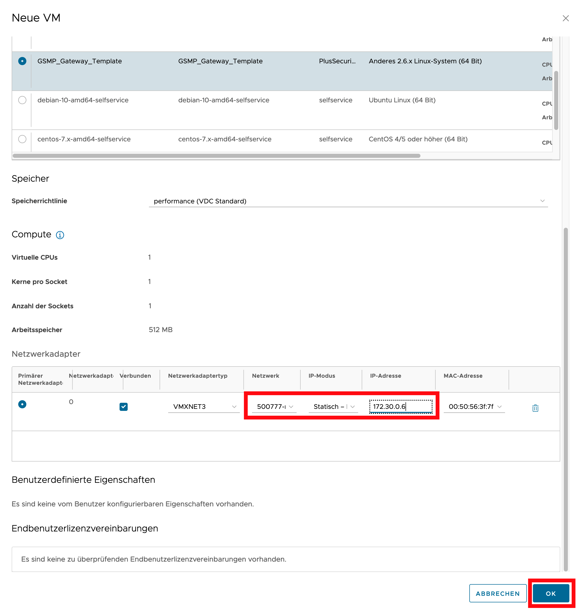

## Configure Firewall

To configure the gateway via Web GUI in step (2.3) Open Gateway Web UI, the internal IP address of the gateway must be made available through a publicly accessible IP address of your Edge Gateway using SNAT, DNAT, and firewall rules.

## Connect to VM Console

After the login prompt appears, enter admin as both username and password.

## Select Network Configuration

## Set Network Configuration Information

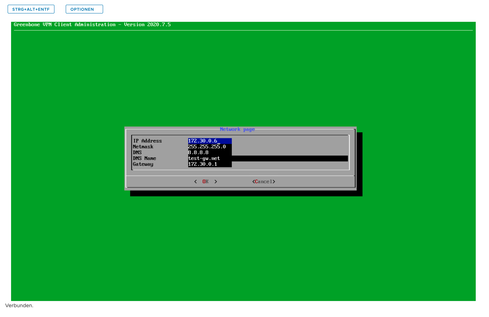

## Test Network Connection to Security Scanner

## Select Gateway Configuration

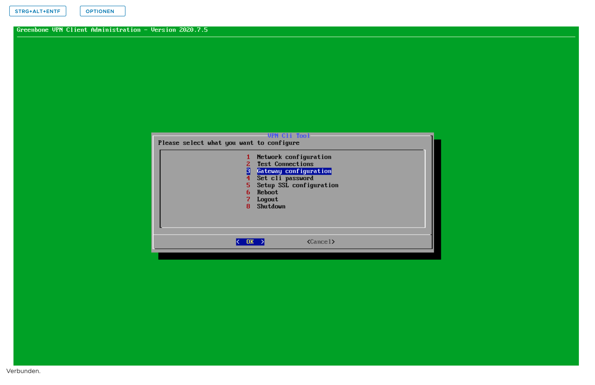

## Select Set Web Password & Assign Password

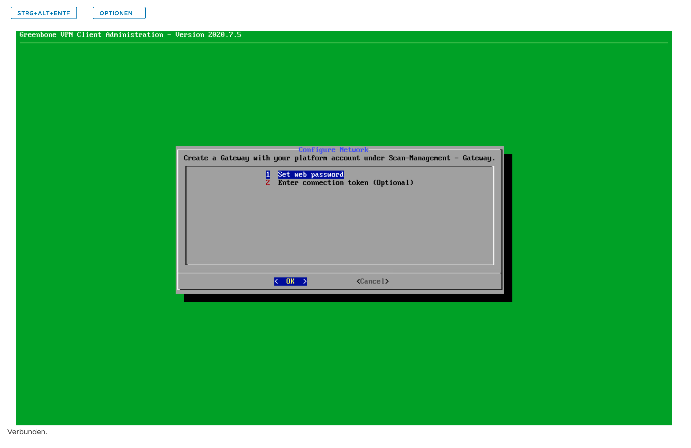

# Configure Gateway

## Create New Gateway

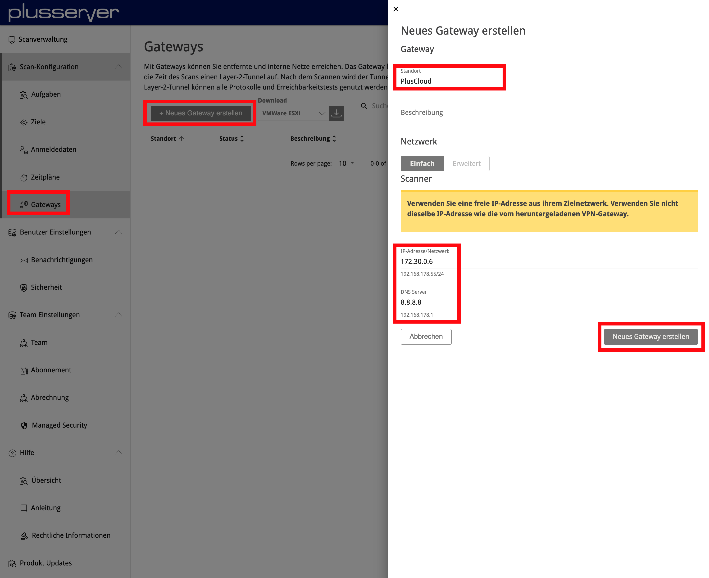
Please specify another free IP address from the network where you installed the gateway.

## Copy Token

To connect the gateway to the Security Scanner, authentication and encryption are necessary. For this, copy the API key from the gateway settings.

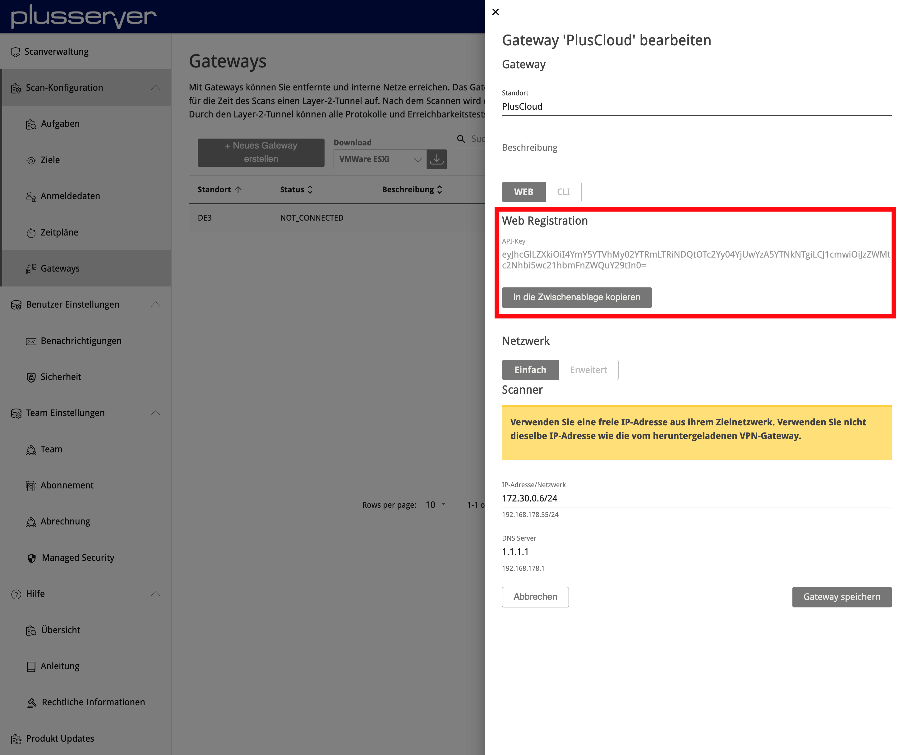

## Open Gateway Web UI

In step (1.6) Configure Firewall, you made the gateway available through a publicly accessible IP address. Now enter the gateway's IP address in your browser and log in using the assigned web password (e.g., https://195.252.XXX.XXX).

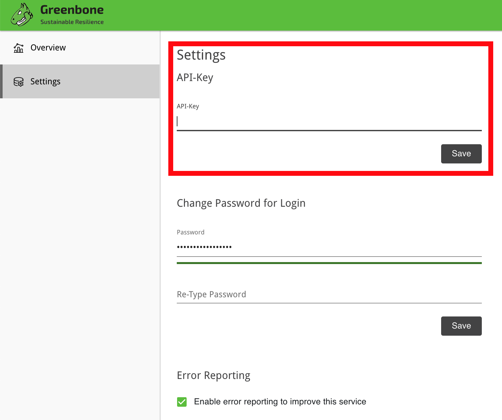

## Check Gateway Status

The gateway is now set up. You can select the gateway for scanning when creating a scan task.
