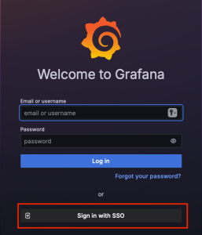
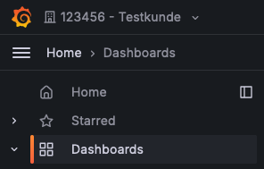
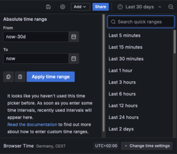

# Reporting Guide

## English

You can find the reporting dashboard under https://reporting.plussecurity.io - click "Sign in with SSO" to sign in via your known Customer IDM credentials.

After logging in, only authorizations for the "Main Org" are available to you by default. The authorizations for other organizations or areas must be set up manually for each user.

To activate the users, please open a service request via our Help Desk and enter the user name and the corresponding e-mail address.

Once you have been activated, you can select your organization in the top left-hand corner. Don't worry - the "Main Org" is the default organization and does not contain any content.

You will find the following dashboards under the burger menu:

Use the time selection at the top right to set the desired time range for the data display (see image below):

### EDR Computer overview

This dashboard shows an overview of the computers in the EDR.

- Result of the current number of computers in the EDR Platform
  - Shows the daily report of computers in the EDR
- Result of the number of computers in the last month
  - Shows the report from the first of the month for reference
- Current endpoints with problems
  - Endpoints whose status is not OK
- List of endpoints

### EDR Overview

This dashboard shows insights into the EDR platform, current alarms and rules that have been triggered.

- Overview of Offenses
  - Pie chart of the offenses
- Number of events
  - Total number of events in SIEM
- Top 10 computers
  - Top 10 computers that appear in events and offenses
- Top 10 rules that triggered an offense
- Top 10 EDR events
  - Top 10 events within the EDR
- Overview of offenses

The severity of an incident is calculated based on relevance, credibility and severity:

**Relevance**: Indicates how much the incident could affect your network. For example, an open port has a high relevance as it is a potential gateway for attacks.

**Credibility**: Describes the reliability of the incident, based on the credibility rating of the log source. Credibility increases when multiple sources report the same incident.

**Severity**: Evaluates the threat level that the source represents in relation to the target's defense readiness. A poorly protected target leads to a higher severity level.

These factors are combined to assess the overall severity of the incident and prioritize appropriate countermeasures.

### SOC Overview

This dashboard shows insight of the SOC, current offenses and an overview of data that is currently residing inside the SOC.

- Offenses overview over time
  - Shows when offenses occurred
- Top Logsources
  - Shows logsources with corresponding eventcount
- Top Talker Source IP
  - Shows top talker IPs that appear in events
- Top Users
  - Shows top users that appear in events
