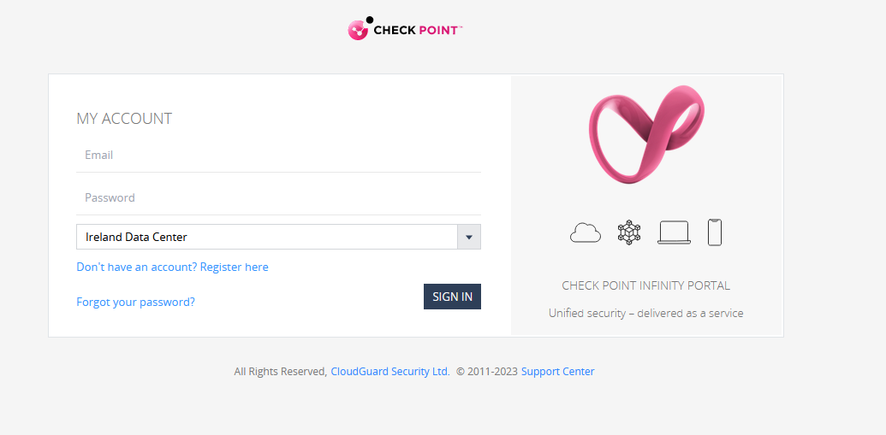
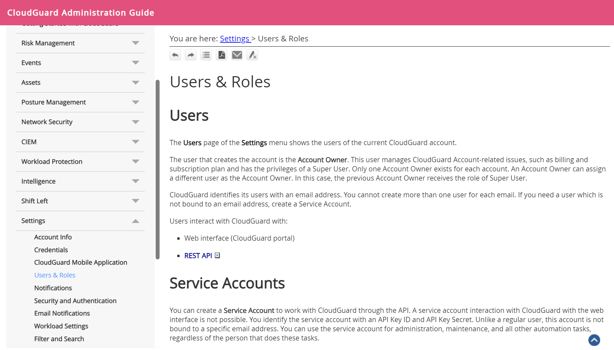
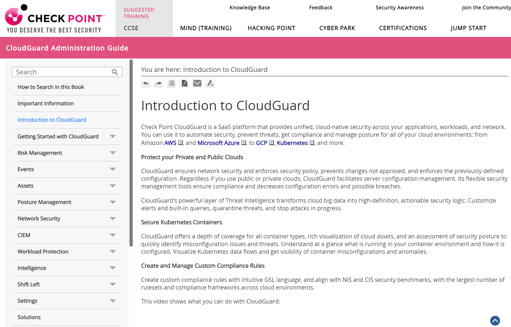
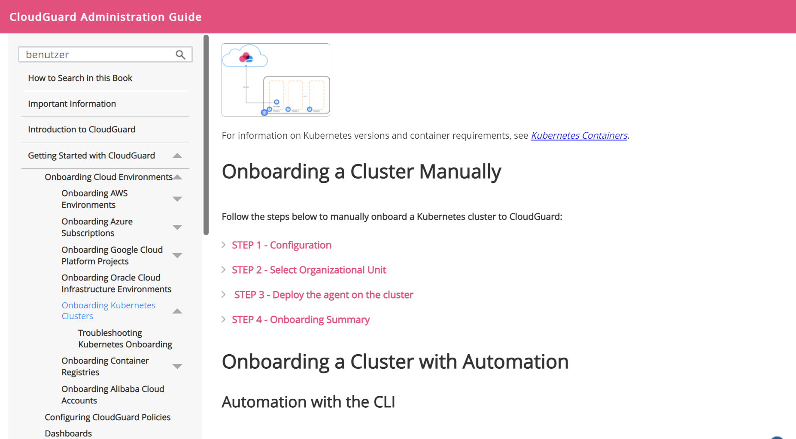

# Workload Protection

## URL of the administration interface and access data

The administration interface can be found at the following link: <https://secure.eu1.dome9.com/>

After setting up your customer account, you will receive a confirmation email. There you will be able to set up the password.

More information about "Permission Management" can be found in the manufacturer's documentation under "Users & Roles" (See Screenshot): <https://sc1.checkpoint.com/documents/CloudGuard_Dome9/Documentation/Settings/Users-Roles.htm?tocpath=Settings%20%7C_____4>

## Manufacturer Documentation

A detailed documentation from Checkpoint can be found under the following link (See Screenshot):
<https://sc1.checkpoint.com/documents/CloudGuard_Dome9/Documentation/Overview/CloudGuard-CSPM-Introduction.htm>

## Documentation for PSKE Integration

To integrate the PSKE, please use the following documentation: <https://sc1.checkpoint.com/documents/CloudGuard_Dome9/Documentation/Assets/Kubernetes.htm>

In our case, the section "Onboarding a Cluster Manually" is needed, steps 1-4 are relevant in this case! (See Screenshot)

